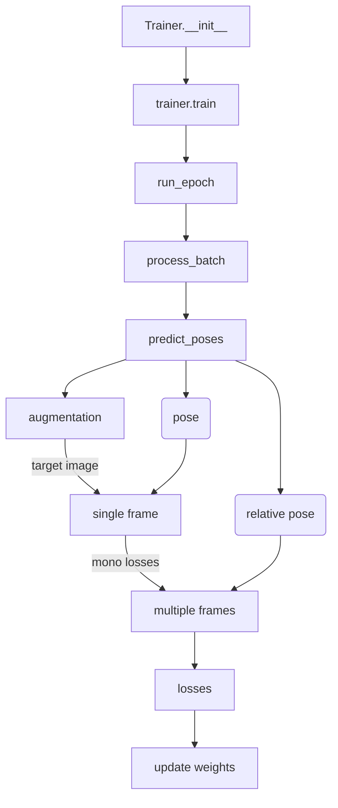

# Code Notes

- Train with three frames, test with one or two frames.

## Networks Architecture

### encoder = ResnetEncoderMatching()

- extract images' features(2), build cost volume, extract matching features(3).

- Resnet 18
- channels = [64, 64, 128, 256, 512]
- 1/4 resolution
- pretrained parameters.
- backprojector = BackprojectDepth()
  - transform a depth image into a point cloud
  - pix_coords: [[0, 0], [0, 1], ..., [width, height]]
  - (pix_coords, inv_K) -> cam_points
- projector = Project3D()
  - project a point cloud into a image
  - $X^{t} = TX^{s}, u^{t}=KX^{t}$
- compute_depth_bins  ->  linspace(min, max, num)
- prematching_conv = conv(64->16, k=1, s=1, p=0) -> relu
- reduce_conv = conv(64+96->64, k=3, s=1, p=1) -> relu
- forward
- ...

### depth = DepthDecoder()

- upconv0[4]: 512 -> 256
- upconv1[4]: 256 + 256 -> 256
- upconv0[3]: 256 -> 128
- upconv1[3]: 128 + 128 -> 128
- upconv0[2]: 128 -> 64
- upconv1[2]: 64 + 64 -> 64
- upconv0[1]: 64 -> 32
- upconv1[1]: 32 + 64 -> 32

- upconv0[0]: 32 -> 16
- upconv1[0]: 16 -> 16
- dispconv[0]: 16 -> 1 -> sigmod -> 1
- dispconv[1]: 32 -> 1 -> sigmod -> 1
- dispconv[2]: 64 -> 1 -> sigmod -> 1
- dispconv[3]: 128 -> 1 -> sigmod -> 1
- ...

### mono_encoder = ResnetEncoder()

- Resnet 18
- [64, 64, 128, 256, 512]
- ...

### mono_depth = DepthDecoder()

- same as depth
- ...

### pose_encoder = ResnetEncoder()

- Resnet 18
- [64, 64, 128, 256, 512]
- ...

### pose = PoseDecoder()

- conv2d(512, 256)
- conv2d(256, 256)
- conv2d(256, 256)
- conv2d(256, 6*2)
- relu
- ...

## Process

self.min_depth_tracker = 0.1

self.max_depth_tracker = 10.0

--min_depth 0.1

--max_depth 100

ResnetEncoderMatching.min_depth_bin=0.1

ResnetEncoderMatching.max_depth_bin=20.0

## Process cont.

1. Initialize the networks: multi-encoder, multi-decoder, mono-encoder, mono-decoder, pose-encoder, pose-decoder.
2. Load data: split the continuous image to 3 frames, do flipping and augmentation, get K and inv_K, all of them are done on 4 scale.
3. Run epoch, process batch (size=10), update weight, save and log.
4. Get all frames (0, -1, 1) **pose** by pose-encoder and decoder, also **relative poses** (0, -1) for matching in multi-encoder and decoder.
5. Apply static frame (p = 1/4) and zero cost volume (p = 1/4) augmentation.
6. Get frame (0)'s depth by mono-encoder and decoder, with **relative poses** with other frames (-1, 1), wrap them aligned with frame (0).
7. Compute mono losses.
8. Get frame (0)'s depth by multi-encoder and decoder with lookup frames (-1) and **relative poses**, in which a cost volume is built by wrapping lookup frame to frame 0 and compute the cost. 2 layers features from image and 3 layers features from the cost volume.
9. Compute multi losses.
10. Mono-depth help decide the d_max and d_min in the cost volume, and also build the consistency mask. 
