# Daily

## 2021/11/25

1. 阅读论文*The Temporal Opportunist: Self-Supervised Multi-Frame Monocular Depth*.
   1. 对研究背景、相关工作、方法、实验有了大致的了解.
   2. 对公式(3)没有理解透彻. ~~(todo)~~
   3. 对SSIM需要进一步深入了解. ~~(todo)~~
   4. 对Cost Volume中的 Hypothesised depth d的取值有疑惑. ~~(todo)~~
   5. 文中多次出现monodepth2[24]的工作, 需要进一步研究. ~~(todo)~~
2. 初步复现了**ManyDepth**.
   1. 可以通过两帧图像输入预训练模型得到效果不错的深度图, 由于灰度值是整数, 应该将深度存成".npy",再读取进行点云的建立. ~~(todo)~~
   2. 手上的KITTI数据集文件组织形式不能拿来训练和评估, 无VPN无法下载指引中的数据集, 训练的实现需要等环境. ~~(todo)~~
   3. 初步尝试了从原图 + 深度图建立相机坐标系中的点云, 成功但效果不佳, 应该是相机内参不准确带来的影响. ~~(todo)~~

## 2021/11/26

1. 解决了 11/25 的问题
   1. 对于1.4, 明白了d的是在整个特征图上取值一致, 并从dmin到dmax插值的P中得到. 跟双目相机原理类似, 最小误差的对应的d就应该是该点的深度, 但是用encoder-decoder去对Cost Volume进行处理.
   2. 对于1.5, 阅读了monodepth2[24]的论文, 详情见下文.
   3. 对于2.1, 从读取深度灰度图".jpg"变成读取深度数据".npy", 进行点云的建立.
   4. 对于2.3, 相机内参乘以图片尺寸后, 建立点云得到了正确的结果.
2. 阅读了综述论文*Deep Learning-Based Monocular Depth Estimation Methods—A State-of-the-Art Review*, 详情见 "review_notes.md".
   1. (单张或多张)二维图像深度检测的应用.
   2. 单目估计深度的问题描述.
   3. 传统方法
      1. 主动方法: Light-based, ultrasound and Time-of-Light (ToF) 的原理, 例如深度相机(如 Kinect) 和激光雷达 (LiDAR).
      2. 被动方法: 利用图片上的特征, multi-view and monocular depth estimation.
   4. 深度学习方法 (每种方法还没精读) ~~(todo)~~
      1. supervised
      2. semi-supervised
      3. self-supervised
   5. 评价标准
      1. Absolute Relative Difference (AbsRel)
      2. Root Mean Square Error (RMSE)
      3. RMSE(log)
      4. Square Relative Error (SqRel)
      5. Accuracy with threshold, thr = 1.25, 1.25^2, 1.25^3.
   6. 接下来应该要初步起稿论文的综述部分. ~~(not recently)~~
3. 阅读了monodepth2的论文*Digging Into Self-Supervised Monocular Depth Estimation*.
   1. 对Depth network和Pose network有了更清晰的了解.
   2. 对loss function有了更清晰的了解. 
   3. 了解对移动或遮挡物体的处理方法(mask). 
   4. 需要进一步学习encoder-decoder和skip connections. ~~(todo)~~
   5. 需要再去翻看文献[64]了解 SSIM(Structural Similarity). ~~(todo)~~

## 2021/11/30

1. 分配了一台笔记本, 配置好了环境, 服务器上的环境也配置完成, 但还没尝试在服务器上训练. ~~(todo)~~
   1. 如果要训练, 数据集是上传到服务器吗? ~~(todo)~~
   2. 服务器的连接方法记录见文末.
2. 继续进行单目深度估计相关文献的调研.
   - 对于11/26的3.5, 了解了SSIM的原理.
   - 按模型训练方法阅读并整理了论文.
3. 小结
   - 从传统单目、双目方法，到深度学习方法——监督学习、自监督学习进行了检索和阅读.
   - 传统方法的推理速度慢, 难以在实际应用.
   - 而深度学习一开始的效果也不是很好, 虽然实验结果中和真实值的误差小, 但深度图的分辨率不高, 因此后面有很多工作都是往提高分辨率这个方向去做.
   - 有几篇比较经典的论文经常被提及:
     - *(2004) Image quality assessment from error visibility to structural similarity*: 对图片之间的结构相似性, 提出了SSIM(Structural Similarity), 经常被用于计算重投影的损失函数.
     - 监督学习中:
       - *(2014) Depth Map Prediction from a Single Image using a Multi-Scale Deep Network*: Makes a coarse global prediction and refines this prediction locally.
       - *(2015) Predicting Depth Surface Normals and Semantic Labels with a Common Multi-scale Convolutional Architecture*: 单个多尺度 CNN 用于多个任务, 其中包括深度预测.
     - 自监督学习中:
       - *(2016) Unsupervised CNN for Single View Depth Estimation Geometry to the Rescue*: 使用两张图象和它们之间的位姿变换来训练.
       - *(2017) Unsupervised Monocular Depth Estimation with Left-Right Consistency*: 使用双目图像进行训练.
       - *(2017) Unsupervised Learning of Depth and Ego-Motion from Video*: 使用单目视频来训练 DepthNet 和 PoseNet.
     - 看了以上无监督的论文后, 我在想如果连相机的内参都没有(比如说: 网上的一段视频), 怎么办? 然后就发现了有学习相机内参的工作: *(2019) Depth From Videos in the Wild Unsupervised Monocular Depth Learning From Unknown Cameras*.
     - 还关注到比较特别的人工标注数据集(sparse supervision from human annotations), 它的做法是在一张图上标注随机两点的相对深度大小关系, 然后使用这样的数据进行学习. 对人来说, 判断深度关系的标注劳动比较简单. 在测试时, 对多个采样点的深度关系进行判断, 从而生成尺度不确定的深度图. 但因为采样点数的影响, 实际上效果看起来比较粗糙, 有鱼鳞一样的效果. *(2015) Learning Ordinal Relationships for Mid-Level Vision*, *(2017) Single-Image Depth Perception in the Wild*.
     - 对于透明和反射区域有解决方案但比较少. *(2015) Multi-view reconstruction of highly specular surfaces in uncontrolled environments*.
4. 整理周报和写本周计划.

## 2021/12/02

1. 继续阅读和整理论文.
   1. 搜集了11篇监督学习, 14篇自监督学习, 1篇半监督学习, 还有8篇左右关于传统方法, 网络结构, 损失函数的论文, 还需要进一步阅读.
   2. 为什么单目深度估计是不适定问题(ill-posed problem)?
      - There is an ambiguity in the scale of the depth.
   3. light-based depth estimation?
      - https://vincentqin.tech/posts/light-field-depth-estimation/
2. 考虑一下应用方向存在的问题.
   - 地面光反射.
3. 师姐的论文, 深度的误差评价?
   - 在文中没有明确说明, 但用到的 KITTI 数据集是 with depth maps capped at 80 meters. 应该是将[~~最远~~]中心距离跟数据集对齐, 进行缩放.
4. 自监督到底算监督 or 无监督?
   - 自监督学习和无监督学习都不需要人工标注的标签, 而监督学习需要.
   - 自监督学习需要标签, 不过不是来自人工标注而是数据本身, 而无监督学习有比如聚类这样的例子.
   - 总的来说, 我认为通常将自监督学习归到无监督这边是因为都不需要带标签的数据这一优点, 但实际上训练模式更像是监督学习.
5. 用实车数据训练 **ManyDepth** 模型. ~~(todo)~~
   - 要继承 MonoDataset 来读取数据.
   - 制作数据集 prepare_train_data.
   - 分出 train/validation/test.

## 2021/12/03

1. 完成实车数据集的制作.

   1. 改写 prepare_train_data.py,  将连续三帧合并, 并把相机内参整理成像 cityscapesDataset 的形式.
   2. 数据分配: train: 797, validation: 102, others for testing.
   3. 训练时将 batch size 改为10以解决显存不足的问题.

2. 模型训练.

   1. epochs = 20, freeze epoch = 15, 使用了KITTI相机的内参.
   2. epochs = 20, freeze epoch = 15, 使用了LeftCamera的内参.
   3. epochs = 20, freeze_epoch = 5,  使用了LeftCamera的内参.
   4. freeze teacher and pose network? ~~(todo)~~

3. 建立点云查看效果.

   - 第1次训练后的模型比预训练模型效果要好.

   - 第2次训练结果传输遇到了问题. ~~(todo)~~

   - 两次训练的结果都显得柱子是向里倾斜的, 而且离得太近. 不过柱子正是最近的点.

   - 地面效果很好.

   - 第3次结果并不好, freeze_epoch 减小好像是针对拥有大量数据的数据集的.

   - 发现深度图上看不出柱子上下有深度差别, 是因为点云建立的问题? ~~(todo)~~

   - 图片:

     
     
     
     

4. 阅读论文.

   - 搜集了12篇监督学习, 14篇自监督学习, 1篇半监督学习, 还有21篇关于传统方法, 网络结构, 损失函数的论文, 还需要进一步阅读.

5. 出了点问题, 模型不能通过 FileZilla 传回来, 远程能看到文件. ~~(todo)~~

   ```bash
   Error: local: unable to open xxx
   
   Error: Critical file transfer error
   ```

   操作步骤和第1次是一样的.

   **Remark 1**: 用 scp 解决了, 看来是 FileZilla 的问题.

   **Remark 2**: 解决了, 之前下载路径不对, 没有权限写入, 要在 local site 这边设好路径.

## 2021/12/07

1. 点云建立的问题已经解决.

   - 最以前建立的点云是正确的, 然后对自己的图片进行测试时更换了相机内参, 但计算错误.

   - $X=Z\frac{u-f_x}{c_x} \rightarrow X=Z\frac{u-c_x}{f_x}$

   - 正确的点云建立如下:

     

2. 单目深度估计综述调研阶段结束, 接下来将重点放在最新的方法, 找出切入点, 可能的切入点如下.

   1. **ManyDepth**默认使用连续3帧进行训练, 使用2帧或1帧进行测试.
      - 训练帧数和测试帧数改变.
      - 需要重新制作训练数据集. ~~(todo)~~
      - 需要找到代码中有关训练帧数的参数并进行修改. ~~(todo)~~
   2. 训练时同时训练PoseNet, 并使用PoseNet预测的帧间变换进行投影计算损失等, 是否用真值进行训练有更好的效果, 并且能解决单目深度尺度的问题. 在**ManyDepth**的issue中找到关于该应用的存在的问题. 
      - [Wrong depth scale when using ground-truth camera poses](https://github.com/nianticlabs/manydepth/issues/22).
      - [depth ground truth error](https://github.com/nianticlabs/manydepth/issues/36).
      - 实践时要关注以上可能出现的问题.
      - 理论上是可行的, 实车数据集里也有附带相机位姿数据, 还有待尝试. ~~(todo)~~

## 2021/12/09

1. 读完另一篇综述: *(2021) Towards Real-Time Monocular Depth Estimation for Robotics: A Survey*.
   - 从1970年到2021年, 对单目深度估计的问题的方法进行了综述.
     - SfM(Structure of Motion) 方法(特征提取和匹配, 计算相机运动得到像素对应的空间位置从而得到深度).
     - 传统基于特征的方法(场景中存在已知大小的物体).
     - 深度学习方法(监督, 自监督, 半监督, Domain Adaptation).
   - 对不同方法的效果进行了比较, 文中从各类方法最优的效果来看, 监督学习效果最好, 紧跟着是半监督学习, Domain Adaption 和自监督学习.
     - 其中自监督效果最好的方法出自 *(2020) Semantically-Guided Representation Learning for Self-Supervised Monocular Depth*, 使用了预训练好的语义分割网络辅助深度估计网络的训练.
   - 在年底之前, 要完成毕业设计的课题申报, 课题审核和开题报告的提交. ~~(todo)~~
2. 继续阅读自监督学习的论文寻找切入点, 主要有两个思考方向: 存在什么问题, 有什么切入方向?
3. 存在的问题:
   1. lack of accuracy in self-supervised learning.
   2. application in real-time system. (trade off with 1)
   3. weak edge.
   4. range cannot be too long.
   5. scale-ambiguous.
   6. occlusions and dynamic objects.
   7. camera intrinsics.
   8. ...
4. 切入方向.
   1. 使用多帧进行训练和测试, 看是否达到更好的效果(对应问题1).
   2. 使用相机真值代替PoseNet, 消除scale-ambiguous(对应问题5).
   3. 使用Attention和其他edge-aware的方法优化深度图不清晰的边缘(对应问题3).
   4. 使用语义, 光流, 表面法线等网络辅助深度网络的训练.
   5. 多视角联合优化.
   6. 使用速度监督(容易获得), 加入损失函数, 消除 scale-ambiguous(对应问题5).
   7. 对相机的内外参进行预测. (理论上不可行)
   8. Cost Volume的d取值从线性变成指数(近处多, 远处少, 而不是均匀分布).
   9. [loss funcition] feature-metric loss, 以解决 photometric-loss在少纹理的地方产生小损失但结果并不准确的问题.
   10. ...
5. *(2020) Forget About the LiDAR: Self-Supervised Depth Estimators with MED Probability Volumes*, 主要是解决 occlusions between the target and the reference images 的问题, 提出 Mirrored Exponential Disparity (MED) probality volumes, 没太精读里面的公式. (todo)
6. *(2020) Feature-Metric Loss for Self-supervised Learning of Depth and Egomotion*花了很大的篇幅讲了通常使用到的损失函数, 同时提出了新的损失函数, 但没读懂里面的$\phi(\cdot)$是怎么学来的. auto-encoder network? ~~(todo)~~

## 2021/12/10

继续研究并探讨了问题和切入点.

**Existing Problems**

1. Lower **accuracy** than other deep learning methods.
2. Heavy **computational burden** hinders the applications in real-time systems.
3. Weak effect on **edges** of objects which are important roles in depth maps.
4. Cannot detect too **far** because of the small difference.
5. Still exists **scale-ambiguous** without true motion supervision.
6. **Occlusions** and **dynamic** objects degrade the performance.
7. Trained with **camera intrinsics** which is often lacked in massive data.
8. The **interpretability** is still a direction.
9. ~~In our scene of garage, the **reflection** from the ground will degrade the performance?~~ ~~No, after testing. See figure in the end.~~ After more epochs, it wil be worse on the ground with reflection.
10. **Generalization**.
11. ...

**Breakthrough Points**

1. (try but not breakthrough) Use **multi-frame** rather than 2 to train or test. <sup>1</sup>
2. ~~Apply **feature pyramid** to accelerate. <sup>2</sup>~~
3. ~~(uncertain) Apply **attention** module and other **edge-aware loss** to improve the vague edge. <sup>3</sup>~~
4. (try) Use **ground-truth of camera motion** instead of PoseNet to eliminate the scale-ambiguous. <sup>5</sup>
5. Use fixed ~~**semantics**~~, **optical flow**, ~~**surface normals**~~ network to assist training the depth network. <sup>1</sup>
6. (hard) Use **multi-view** images to improve. <sup>1</sup>
7. ~~(same as 4) Add **velocity supervision** to eliminate the  scale-ambiguous. <sup>5</sup>~~
8. ~~Learn **camera intrinsics** to train more easily and get better generalization with different data. <sup>10</sup>~~
9. (try but not breakthrough) Change the **linear space to exponential space** of the value of d of in the cost volumes, making more predictions on the area nearby. <sup>1</sup>
10. ~~(already apply in **ManyDepth**) Change photometric-loss to **feature-metric loss** to solve the problem on texture-less regions, making use of the information. <sup>6</sup>~~
11. ...

总的来说, 经过讨论后, 未来的工作有以下方向(按顺序列举).

1. 多帧训练和测试.
2. cost volume 从线性插值变为指数插值.
3. 使用相机运动真值代替 PoseNet.
4. 加入损失函数, 使用相机运动真值监督 PoseNet 的学习.
5. 融入更多的特征, 光流, census, ORB 等等特征.
6. 多视角联合优化.

- 可以多进行模型训练, 显卡暂时闲置, 提高训练的轮数.

还有一个很值得思考的方向:

人对距离的感知是相对的而不是绝对的, 就跟人感知温度一样不能准确得到温度是多少度, 而是一物体比另一物体更热/冷. 距离也是一样的, 人不能直接看出某一物体的距离大小, 而是通过双眼的视差得到的. 现在感知的目标都是得到准确的深度值, 如果将相对深度作为训练的监督, 输入一张图, 和任意两点, 得到两点的相对深度关系, 可能更符合人的感知.

但问题又来了, 人对距离的感知方式就是正确的吗? 得到距离具体的数值是更强的体现, 不应该将人的智能作为目前人工智能的一个上限. 得到具体的距离同样可以实现人的功能——判断相对深度大小. 仿生具有合理性, 但科学可以做得更好.

## 2021/12/14

1. 明确了之后要做的方向.

   1. 首先尝试多帧和Cost Volume的d取值.
   2. 然后用相机运动监督PoseNet的学习.
   3. 如果有机会的话, 额外加入特征, 看是否对效果有提升.

2. 对上次100轮训练的结果截去天花板查看效果:

   
   

3. 使用5帧训练20轮, 与3帧训练20轮的结果进行对比, 效果并不好, 还需要更深入理解代码.

   1. 原来训练时使用的是2张误差还是3张的误差? **3张**
   2. 和预测的pose的图片对应关系是否改对了?

4. 使用5帧训练100轮得到的效果.

5. 使用1张图和2张图进行测试, 1张图的效果还能接受, 此时Cost Volume被设为0, 进入Encoder-decoder网络的只有目标图的特征图, 有些许疑惑, 或许Cost Volume的作用不大, 之后考虑将bias path断掉看看训练效果. (todo)

6. 使用inverse空间训练.

   1. 就是$1/d$在$1/d_{max}$到$1/d_{min}$之间插值, 短距离选择更多, 远距离更少. 例如: [1, 10]线性插值是 1, 2, .., 10; 倒数插值是1, 1.11, 1.25, 1.43, 1.67, ..., 3.33, 5, 10.

   2. 训练了20轮, 可以平行对比远处的效果不如原来, 但近处的效果更好一些.

   3. 训练更多轮次进行对比.

   4. 结果:

      |         Depth Map          | epochs |
      | :------------------------: | :----: |
      |   |   5    |
      |  |   20   |
      |  |   60   |
      |  |  100   |

      |            1 infer            |         2 infer          |
      | :---------------------------: | :----------------------: |
      |  |  |

      |          linear          |             inverse              |
      | :----------------------: | :------------------------------: |
      |  |  |

## 2021/12/16

1. 阅读了 *(2021) Deep Two-View Structure-from-Motion Revisited*.  **光流**

   1. 监督学习, 更新光流估计网络.
   2. 使用光流得到两帧相对运动, 变换后作Cost Volume, 再通过 Soft Argmin得到深度.
   3. 使用光流进行特征匹配, 用传统SLAM方法计算得到相机运动, 代替了PoseNet.
   4. 但是它的深度推测还是使用两帧颜色对比而不是特征.
   5. 虽然讲的是监督学习, 但里面对方法的revisit也很全, 然后光流可以在之后做到的时候进行借鉴.

2. 更新了一些脚本, 以后不需要再复制一些终端命令来进行训练, 测试.

3. 多种参数组合进行训练和测试.

   1. inverse训练了100轮, 效果不好:

      |        linear 20         |            inverse 20            |
      | :----------------------: | :------------------------------: |
      |  |  |
      |      **linear 100**      |         **inverse 100**          |
      |  |  |

   2. 调整了freeze_epoch和step_size, 结论是这两个参数跟着 epochs成比例增大效果最好. (目前来看是这样)

   3. 正在训练5帧300轮. ~~(todo)~~

4. 钻研代码, 整理了一些笔记, 需要继续深入.

5. 感受了实车的感知和控制.

## 2021/12/17

1. 5帧300轮有了结果, 效果不如3帧100轮, 有如下的可能性.

   1. 5帧训练还不够充分.

   2. 测试时使用2帧图像进行判断, 训练时使用5帧的意义不明.

   3. 结果:

      |     3 frame 100 epochs      |     5 frames 300 epochs     |
      | :-------------------------: | :-------------------------: |
      |  |  |
      |  |  |

2. 进行单步调试深挖网络结构.

   1. 记录了一些笔记, 更深刻地了解网络结构.
   2. 还没完全看完. ~~(todo)~~

3. 笔记内容

   1. Networks

      - encoder = ResnetEncoderMatching()
        - extract images' features(2), build Cost Volume, extract matching features(3).
        - Resnet 18
        - channels = [64, 64, 128, min256, 512]
        - 1/4 resolution
        - pretrained
        - backprojector = BackprojectDepth()
          - transform a depth image into a point cloud
          - pix_coords: [[0, 0], [0, 1], ..., [width, height]]
          - (pix_coords, inv_K) -> cam_points
        - projector = Project3D()
          - project a point cloud into a image
          - $X^{t} = TX^{s}, u^{t}=KX^{t}$
        - compute_depth_bins  ->  linspace(min, max, num)
        - prematching_conv = conv(64->16, k=1, s=1, p=0) -> relu
        - reduce_conv = conv(64+96->64, k=3, s=1, p=1) -> relu
        - forward (todo)
        - ...
      - depth = DepthDecoder()
        - upconv0[4]: 512 -> 256
        - upconv1[4]: 256 + 256 -> 256
        - upconv0[3]: 256 -> 128
        - upconv1[3]: 128 + 128 -> 128
        - upconv0[2]: 128 -> 64
        - upconv1[2]: 64 + 64 -> 64
        - upconv0[1]: 64 -> 32
        - upconv1[1]: 32 + 64 -> 32
        - upconv0[0]: 32 -> 16
        - upconv1[0]: 16 -> 16
        - dispconv[0]: 16 -> 1 -> sigmod -> 1
        - dispconv[1]: 32 -> 1 -> sigmod -> 1
        - dispconv[2]: 64 -> 1 -> sigmod -> 1
        - dispconv[3]: 128 -> 1 -> sigmod -> 1
      - mono_encoder = ResnetEncoder()
        - Resnet 18
        - [64, 64, 128, 256, 512]
        - ...
      - mono_depth = DepthDecoder()
        - same as depth
        - ...
      - pose_encoder = ResnetEncoder()
        - Resnet 18
        - [64, 64, 128, 256, 512]
        - ...
      - pose = PoseDecoder()
        - ...

   2. Process

      ```mermaid
      flowchart
      A[Trainer.__init__] --> B[trainer.train]
      B --> C[run_epoch]
      C --> D[process_batch]
      D --> E[predict_poses]
      E --> F(pose)
      E --> H[augmentation]
      E --> G(relative pose)
      H -- target image --> I[single frame]
      I -- mono losses --> J[multiple frames]
      J --> K[losses]
      K --> U[update weights]
      F --> I
      G --> J
      ```


## 2021/12/21

1. 多帧训练, 需要使用多帧测试, 不然结果没有说服力. (todo)
2. 结束inverse space方向的尝试.
3. 参考PackNet关于速度监督的损失函数. ~~(todo)~~
4. 再次深入阅读**ManyDepth**论文, 有新发现.
   1. monoDepth是用来解决移动物体的问题, 对移动物体加上Mask, 而dmax和dmin是通过每轮深度预测的最大最小值的平均值进行调整, ~~并不是 monoDepth 提供的辅助.~~ 是monoDepth预测的最大值最小值平均.
   2. 对移动物体加上Mask, 使得投影误差正确, 同时使Mask内部的深度预测与monoDepth的结果趋向一致(文中说monoDepth不怎么受移动物体的影响, 所以可以认为它是正确的).
   3. 随机将source image换成空图, 以训练没有Cost Volume应用下的能力; 随机将source image换成target image, 即比如[-1, 0]变为[0, 0], 以训练相机在静止时的能力.
   4. 目前剩depth encoder还未完全精读. ~~(todo)~~

## 2021/12/30

1. 多轮次的训练造成了过拟合:

   |        2000 epochs         |
   | :------------------------: |
   |  |

2. 挂着XX-Net下载KITTI数据集. ~~(todo)~~ (Current = 2011_09_26_drive_0019)

3. 继续钻研代码, 写注释及笔记.

   1. Initialize the networks: multi-encoder, multi-decoder, mono-encoder, mono-decoder, pose-encoder, pose-decoder.
   2. Load data: split the continuous image to 3 frames, do flipping and augmentation, get K and inv_K, all of them are done on 4 scale.
   3. Run epoch, process batch (size=10), update weight, save and log.
   4. Get all frames (0, -1, 1) **pose** by pose-encoder and decoder, also **relative poses** (0, -1) for matching in multi-encoder and decoder.
   5. Apply static frame (p = 1/4) and zero cost volume (p = 1/4) augmentation.
   6. Get frame (0)'s depth by mono-encoder and decoder, with **relative poses** with other frames (-1, 1), wrap them aligned with frame (0).
   7. Compute mono losses.
   8. Get frame (0)'s depth by multi-encoder and decoder with lookup frames (-1) and **relative poses**, in which a cost volume is built by wrapping lookup frame to frame 0 and compute the cost. 2 layers features from image and 3 layers features from the cost volume.
   9. Compute multi losses.
   10. Mono-depth help decide the d_max and d_min in the cost volume, and also build the consistency mask. 

4. 要抓紧开始进行对位姿监督的修改.

## 2022/1/6

1. 重新整理数据集制作的过程, 融合了相机位姿真值数据, 每一份文件用第0帧的序号命名, 其中有3行位姿数据分别是-1, 0, 1帧对应的位姿.

2. 想要用来替换PoseNet还需要在代码中将其处理成一个batch. ~~(todo)~~

3. 显卡变为3080 Ti之后, PyTorch的cuda版本跟不上, 原来为1.7.1 + 10.2.

   - 改为1.10.1 + 11.3之后, 代码在图像增强部分出现报错, 估计是torchvision版本更新后代码不兼容造成的.
   - torchvision版本跟torch版本对应, 不改动代码的情况下, 回退torch版本.
   - 改为1.7.1 + 11.0之后, 前面图像增强部分的问题解决.
   - 但是显存不够了, 不知道是不是因为cuda的版本上来了导致占用显存更多了.
   - 二分法尝试batch_size = 5是极限了, 比之前少了一半, 收敛速度差了很多.

4. 稍微实现了一下真值代替PoseNet, 但可能还存在问题。

   - 第一次尝试时因为计算错误, 误差巨大.
   - 修改后有收敛的趋势, 但由于batch_size仅为5, 收敛也不明显.
   - 等待20轮训练完成看看效果. ~~(todo)~~
   - 效果完全不行, 应该是哪里错了. ~~(todo)~~
   - 好像不能不训练PoseNet, 测试的时候还是要用PoseNet来估计位姿从而作出Cost Volume.
   - 直接删去不可行, 不训练也不对.

   
   
   
   
   
   

## 2022/1/7

1. batch size又可以设成10了, 重新训了20轮位姿真值替代的, 效果和昨天差不多.
2. 尝试直接复制增加数据集, 让数据在一轮训练被使用两次及以上. ~~(todo)~~
3. 正在训练2000轮, 之后看是否收敛. ~~(todo)~~
4. 增加位姿监督的损失函数, 等待训练. ~~(todo)~~
5. 今天中途被叫回学校开会了, 进度有些慢, 还看不出损失函数的效果.

## 2022/1/10

1. 复制增加数据集, 一轮训练使用两次, 效果很显著:

   |      |                            |
   | ---- | :------------------------: |
   | ori  |    |
   | aug  |  |

2. 直接使用位姿真值代替 PoseNet, 估计时使用单帧估计, 效果依然不佳.

3. 增加位姿监督损失函数.

   1. $L_V=\Vert{t-t^*}\Vert_1$
   2. 训练不发散, 但$L_V$一直不收敛.
   3. 增大训练轮数. ~~(todo)~~

   |        |                              |
   | :----: | :--------------------------: |
   |  ori   |      |
   | gt sup | 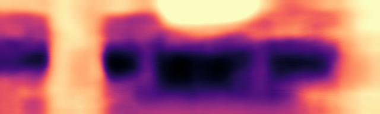 |

   

## 2022/1/11

1. 位姿监督损失函数加入后, 训练1000轮.

   1. 结果.

      
      
      

   2. 无法判断是不是真的往真实值趋近, 需要进一步开发. ~~(todo)~~

   3. 损失函数中, 新增的损失项没有优化.

      
      

   4. 100轮结果.

      

2. 正在仔细研究代码.

## 2022/1/12

1. 对位姿监督的损失函数做了多个实验测试.

   1. 20轮, weight = 0.1训练结果对比.

      |      type      |          depth map           |
      | :------------: | :--------------------------: |
      |     origin     |      |
      | pose supervise |  |

   2. 100轮和1000轮, weight = 0.1, 训练结果对比.

      | epochs |           depth map           |       remark        |
      | :----: | :---------------------------: | :-----------------: |
      |  100   |   | $L_V$不发散也不收敛 |
      |  1000  |  |        同上         |

   3. 20轮不同weight训练结果对比.

      | weight |            depth map             |          remark          |
      | :----: | :------------------------------: | :----------------------: |
      |  0.1   |      |   $L_V$不发散也不收敛    |
      |  0.5   |  |           同上           |
      |  0.8   |  |           同上           |
      |   1    |    | $L_V$收敛, 但其它$L$发散 |

   4. 20轮, weight = 1, 两次训练结果对比.

      
      

2. 针对目前出现的问题, 亟需进行的工作如下:

   1. 仔细阅读PackNet损失函数实现方法, 对PoseNet部分如何进行参数更新? (todo)
      1. PackNet针对两个网络有两个学习率, 如何实现? (todo)
   2. 对PoseNet进行训练时只使用位姿监督, 而不用反投影损失函数等, 但深度估计网路需要用到这些误差, 如何切断? 清除使用到的预测位姿的梯度记录. (todo)
   3. 损失函数好像有点问题, 不是差值的1范数, 是2范数的差值的绝对值. ~~(todo)~~

## 2022/1/13

1. 位姿监督损失函数更改. $L_V=\Vert t-t^* \Vert_1 \rightarrow abs(\Vert t \Vert_2 - \Vert t^* \Vert_2)$, 权重设为0.05.

   | epochs |              depth map              | remark(min表示推断最小深度) |
   | :----: | :---------------------------------: | :-------------------------: |
   |   20   |   |        min = 40.298m        |
   |  100   |  |        min = 33.422m        |

2. 尺度都是不对的.

3. 将位姿监督迟点加入到网络中. 比如训练20轮, 在第10轮开始监督位姿尺度, 在第15轮停止训练PoseNet.

   | epochs |               depth map                | remark(min表示推断最小深度) |
   | :----: | :------------------------------------: | :-------------------------: |
   |   20   |   |        min = 29.974m        |
   |  100   |  |        min = 38.280m        |
   |  100   |                |        min = 1.489m         |

4. 原先的程序存在一个bug, 学习率按道理是x轮下降, 但是在freeze了PoseNet之后, 重置了优化器和学习率调整器, 导致step归零了.

5. 要去看PoseNet的输出到底是什么? ~~(todo)~~
   tensor([[[ 9.9998e-01,  6.7407e-03,  9.1480e-04,  7.4870e-06],
            [-6.7282e-03,  9.9989e-01, -1.3060e-02,  1.5610e-03],
            [-1.0027e-03,  1.3054e-02,  9.9991e-01,  4.7845e-02],
            [ 0.0000e+00,  0.0000e+00,  0.0000e+00,  1.0000e+00]]])

6. 位姿监督好像有效, 训练后的位姿估计就是[0 ,0, 1], 但有没有可能是网络回归到[0, 0, 1]上去, 而不是根据图像判断出来的?

7. 需要再理顺网络结构.

## 2022/2/22

1. 假期大体完成专利的草稿, 还需要修订.
2. 将完整的KITTI数据集拷贝到了服务器中, 接下来可以复现代码在KITTI数据集上训练.
3. 使用第二张显卡进行训练, 只需要在训练程序运行前增加一个代表显卡ID的环境变量. [设置环境变量指定显卡](https://zhuanlan.zhihu.com/p/166161217)
4. 整理代码, 将加入位姿监督的代码融合进原始代码中, 一同更新至远程代码仓库.
5. 测试时估计的位姿是正确的1m, 但是有可能是无论如何都估计为1m. 可以尝试将部分帧删除后, 再制作数据集进行训练, 使得训练时不是所有帧之间都是等间隔的. ~~(todo)~~
6. 假设在$I_t$中一个像素$v$, 坐标为$p^t_v$, 深度为$d_v$, 则$x^t_v=d_vK^{-1}p^t_v$, $x^{t+1}_v=T^{t+1}_tx^t_v$,再进入像素坐标$p^{t+1}_v\sim Kx^{t+1}_v$.

## 2022/2/23

1. 对于昨天的制作非等间隔训练数据集, 增加了采样间隔的随机选择, 有50%概率间隔为1, 50%概率间隔为2.

2. 使用非等间隔训练数据集训练整个网络, 测试得到的位姿估计准确, **能辨别1m和2m的位移**, ~~但是深度还是与真实值相差20倍的尺度~~.

   
   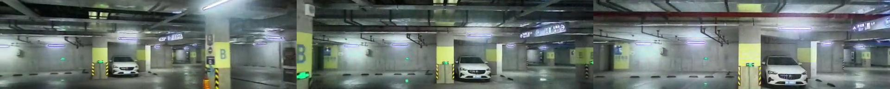

   上图分别为以10249和10250为中心采样的连续帧, 其中第一行间隔为1, 第二行间隔为2, 即: (248, 249, 250)和(248, 250, 252). 所以可以看到, 左上和左下相同, 右上和中下相同. 从位姿信息也可看到这样的效果, 证明数据集的制作是成功的.

   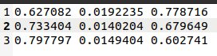
   

3. **解决尺度不正确**, 深度估计网络生成的视差最后是由Sigmoid输出的, 范围是(0, 1), 对应深度范围就是(1,+oo). 假设想要深度范围在(0.1, 100), 则视差范围应该在(0.01, 10). 所以需要做一定的尺度变换: $y=a+(b-a)x$, 其中$a=0.01,b=10$, 这样结果就能落在想要的范围里. 模型是使用变换尺度后的这个深度进行投影等操作. 在代码自带的测试脚本中, 通过深度估计网络得到的视差没有经过变换尺度就直接输出出来. 模型是正确的, 错误发生在测试时.

   - 位姿鲁棒正确但深度尺度不对:

     tensor([[[ 9.9999e-01,  3.3307e-04, -3.1562e-03,  1.0728e-02],

        [-3.8365e-04,  9.9987e-01, -1.6040e-02,  4.5055e-02],

        [ 3.1505e-03,  1.6041e-02,  9.9987e-01,  1.1143e+00],

        [ 0.0000e+00,  0.0000e+00,  0.0000e+00,  1.0000e+00]]],

        device='cuda:0')

     Min = 33.089, Max = 1077.791

     


   - 位姿鲁棒正确但深度尺度不对:

     tensor([[[ 1.0000,  0.0023,  0.0033,  0.0322],

        [-0.0023,  1.0000,  0.0041,  0.1152],

        [-0.0033, -0.0041,  1.0000,  1.9730],

        [ 0.0000,  0.0000,  0.0000,  1.0000]]], 

        device='cuda:0')

     Min = 33.273, Max = 1073.443

     


   - 位姿深度均正确:

     tensor([[[ 9.9999e-01,  3.3307e-04, -3.1562e-03,  1.0728e-02],

        [-3.8365e-04,  9.9987e-01, -1.6040e-02,  4.5055e-02],

        [ 3.1505e-03,  1.6041e-02,  9.9987e-01,  1.1143e+00],

        [ 0.0000e+00,  0.0000e+00,  0.0000e+00,  1.0000e+00]]],

        device='cuda:0')

     Min = 3.206, Max = 51.897

     

4. 接下来应该解决如何提高精度的问题, 如何训练才能最快收敛? Cost Volume在其中起到的作用究竟有多大? 如何更好地利用它的信息? (todo)

5. 复现一下在KITTI数据集上的训练. 开始训练... ~~(todo)~~

## 2022/2/24

1. 修复了之前代码中存在的学习率下降的bug(01/13,#4), 即在停止训练PoseNet时重置了优化器和学习率调整器, 轮次被重新计算了, bug导致实际上学习率并没有下降.

2. 整理代码, 将位姿直接代替PoseNet方法融合进来, 并在解决bug之后训练100轮得到了不错的效果, 深度的尺度也是正确的.

   | epochs |           depth map           | remark(min表示推断最小深度) |
   | :----: | :---------------------------: | :-------------------------: |
   |   20   | 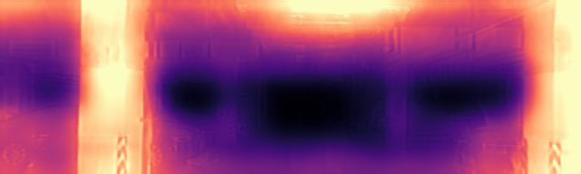  |        min = 0.134m         |
   |  100   |  |        min = 3.485m         |

   tensor([[[ 1.0000e+00, -7.1216e-04,  1.8875e-05,  7.5349e-04],

      [ 7.1214e-04,  1.0000e+00,  9.5089e-04, -5.6369e-04],

      [-1.9561e-05, -9.5087e-04,  1.0000e+00,  2.5150e-04],

      [ 0.0000e+00,  0.0000e+00,  0.0000e+00,  1.0000e+00]]],

      device='cuda:0')

   Min = 3.485, Max = 45.724

3. KITTI训练被中断了, 昨天晚上8点多服务器是不是死机了:( , 它需要半天的时间训练, 等空闲时再进行训练.

4. 正在进行位姿监督100轮训练. ~~(todo)~~

   | epochs |           depth map           | remark(min表示推断最小深度) |
   | :----: | :---------------------------: | :-------------------------: |
   |   20   | 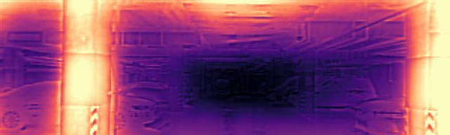  |        min = 2.044m         |
   |  100   | 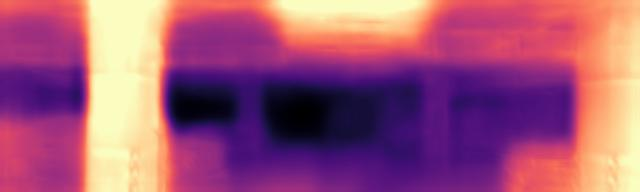 |        min = 3.711m         |

   - -1帧

     tensor([[[ 1.0000,  0.0014, -0.0022,  0.0088],

        [-0.0014,  0.9999, -0.0139,  0.0445],

        [ 0.0022,  0.0139,  0.9999,  1.0407],

        [ 0.0000,  0.0000,  0.0000,  1.0000]]], 

        device='cuda:0')

     Min = 3.711, Max = 57.996


   - -2帧:

     tensor([[[ 9.9999e-01,  1.6858e-04,  4.1448e-03,  3.6700e-02],

        [-1.8286e-04,  9.9999e-01,  3.4451e-03,  1.2205e-01],

        [-4.1442e-03, -3.4458e-03,  9.9999e-01,  2.1104e+00],

        [ 0.0000e+00,  0.0000e+00,  0.0000e+00,  1.0000e+00]]],

        device='cuda:0')

     Min = 3.698, Max = 58.754

## 2022/3/1

1. 修复学习率bug后, 使用KITTI_RAW数据集进行复现.

   - 训练20轮, 15轮停止PoseNet训练, 下降学习率.
   - 修复后的结果定性地看更优.
   - 补充定量的评价. ~~(todo)~~
   - 定性结果:

   |              |                    Image                    |
   | :----------: | :-----------------------------------------: |
   |     原图     |          |
   |  预训练模型  |  |
   | 复现训练模型 | 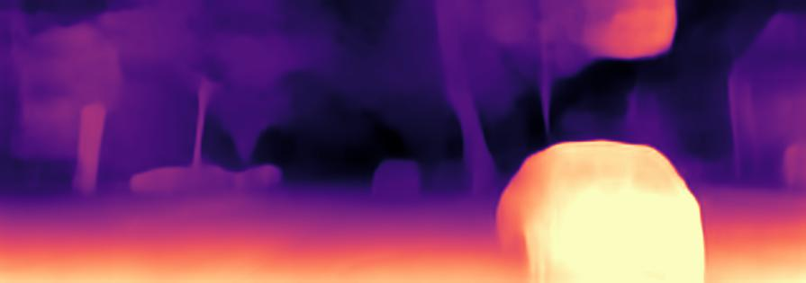 |

   - 定量结果:

     |              |  abs_rel  |  sq_rel   |   rmse    | rmse_log  |    a1     |    a2     |    a3     |
     | :----------: | :-------: | :-------: | :-------: | :-------: | :-------: | :-------: | :-------: |
     |  预训练模型  | **0.098** |   0.770   |   4.458   | **0.176** | **0.900** | **0.965** | **0.983** |
     | 复现训练模型 |   0.100   | **0.755** | **4.423** |   0.178   |   0.899   |   0.964   | **0.983** |

     从定量结果上看效果差不多, sq_rel和rmse均有提升, 其余指标相差不大于0.002.

2. 下载好了KITTI_ODOM数据集中的RGB图像和位姿真值, 并拷贝到服务器上, 

3. 正在下载KITTI_ODOM数据集中的雷达真值. p.s. 格物钛是个好网站. ~~(todo)~~

4. 使用KITTI_ODOM制作训练集, 类似于之前的车库数据集的方法. ~~(todo)~~

5. 正在训练更多轮次的位姿监督. ~~(todo)~~

## 2022/3/2

1. 训练200轮位姿监督, 对比如下:

   | epochs |           depth map           |
   | :----: | :---------------------------: |
   |   20   |   |
   |  100   |  |
   |  200   | 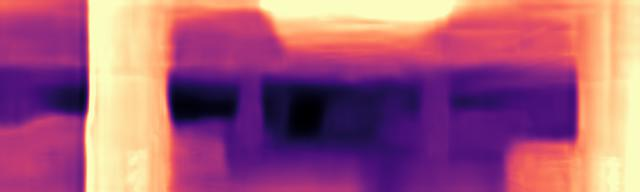 |

2. 完成下载KITTI_ODOM数据集中的雷达真值, 并整理至服务器.

3. 使用KITTI_ODOM制作了训练集.

4. 使用KITTI_ODOM进行位姿监督训练. ~~(todo)~~

5. 车库数据集位姿监督训练的模型在KITTI上定量评价. (效果可预想肯定不佳, 因为模型可能已经过拟合到车库场景. ~~todo~~)

   - 结果: 

     |       模型        | 是否median scale | abs_rel | sq_rel |  rmse  | rmse_log |  a1   |  a2   |  a3   |  med   |  std  |
     | :---------------: | :--------------: | :-----: | :----: | :----: | :------: | :---: | :---: | :---: | :----: | :---: |
     |    预训练模型     |        是        |  0.098  | 0.770  | 4.458  |  0.176   | 0.900 | 0.965 | 0.983 | 34.644 | 0.083 |
     |    预训练模型     |        否        |  0.971  | 15.185 | 19.233 |  3.553   | 0.000 | 0.000 | 0.000 |   -    |   -   |
     | 车库训练模型(100) |        是        |  0.350  | 3.658  | 10.656 |  0.481   | 0.394 | 0.688 | 0.849 | 1.153  | 0.277 |
     | 车库训练模型(100) |        否        |  0.367  | 4.125  | 11.593 |  0.562   | 0.316 | 0.622 | 0.792 |   -    |   -   |
     | 车库训练模型(200) |        是        |  0.332  | 3.301  | 10.247 |  0.453   | 0.423 | 0.727 | 0.873 | 1.242  | 0.234 |
     | 车库训练模型(200) |        否        |  0.357  | 4.000  | 11.552 |  0.549   | 0.331 | 0.618 | 0.800 |   -    |   -   |

   - 可以看到, 位姿监督的模型即使在不同数据集上, 也达到了一定的精度. 更重要的是, 预测深度的中位数, 与真值数据的中位数的比例仅有1.153, 找到更合适的收敛方法会进一步提高性能.

## 2022/3/3

1. 尝试在对位姿变换矩阵求逆时使用它的特性, 转换为转置和乘法问题, 但是实测效率不如直接求逆.

2. 训练时出现了一个错误, 导致昨天的KITTI_ODOM没有训练完成, 该错误是发生在计算位姿监督损失函数处的, 错误的说明不明确, 经过测试不是代码的错误, 可能是内存不够(重新加载最后保留的模型, 然后进行位姿监督, 运行正常), 之前遇到的时候通过减少batch_size可以解决, 但是现在大数据集如果减少batch_size将很影响训练速度.

3. 使用KITTI_ODOM进行位姿监督训练

   - 在KITTI_ODOM测试集测试.

     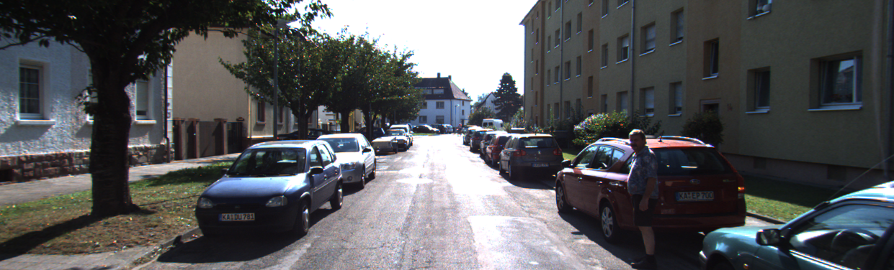

     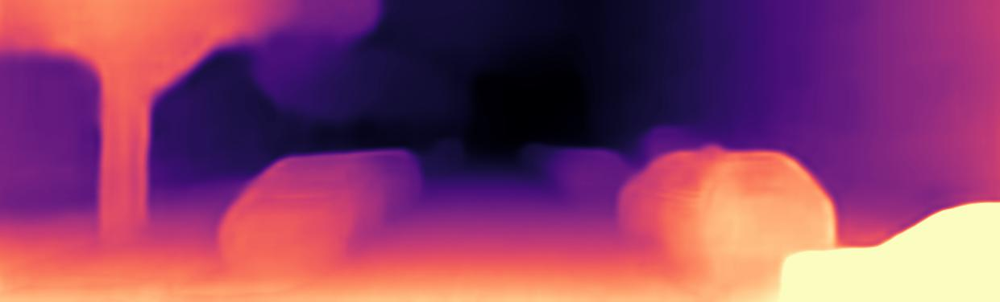

     得到结果的尺度是正确的, 但是效果还不是太好.

   - 在车库图像上测试.

     

     

     尺度也是正确的, 但可能是因为KITTI_ODOM训练集中都是室外环境, 所以对该图像的天花板部分并没有效果.

4. 进行KITTI_ODOM无位姿监督训练20轮对比差异. ~~(todo)~~

5. 目前只跑通对KITTI数据集的定量测试, KITTI_ODOM的定量测试还需要修改. (NOT DO)

## 2022/3/7

1. 将使用KITTI_ODOM数据集训练的模型在KITTI_RAW上进行定量测试, 得到的结果对比如下所示.

   |       模型        | 是否median scale |  abs_rel  |  sq_rel   |   rmse    | rmse_log  |    a1     |    a2     |    a3     |    med    |    std    |
   | :---------------: | :--------------: | :-------: | :-------: | :-------: | :-------: | :-------: | :-------: | :-------: | :-------: | :-------: |
   |    预训练模型     |        是        | **0.098** | **0.770** | **4.458** | **0.176** | **0.900** | **0.965** | **0.983** |  34.644   |   0.083   |
   | 车库训练模型(100) |        是        |   0.350   |   3.658   |  10.656   |   0.481   |   0.394   |   0.688   |   0.849   |   1.153   |   0.277   |
   | 车库训练模型(100) |        否        |   0.367   |   4.125   |  11.593   |   0.562   |   0.316   |   0.622   |   0.792   |     -     |     -     |
   | 车库训练模型(200) |        是        |   0.332   |   3.301   |  10.247   |   0.453   |   0.423   |   0.727   |   0.873   |   1.242   |   0.234   |
   | 车库训练模型(200) |        否        |   0.357   |   4.000   |  11.552   |   0.549   |   0.331   |   0.618   |   0.800   |     -     |     -     |
   | ODOM w/o sup(20)  |        是        |   0.108   |   0.760   |   4.863   |   0.190   |   0.872   |   0.956   |   0.981   |  32.320   |   0.123   |
   |  ODOM w/ sup(20)  |        是        |   0.116   |   0.853   |   4.985   |   0.194   |   0.861   |   0.955   |   0.981   | **1.094** | **0.080** |
   |  ODOM w/ sup(20)  |        否        |   0.140   |   0.997   |   5.529   |   0.228   |   0.811   |   0.937   |   0.974   |     -     |     -     |

   效果与论文模型差距不大, 且尺度几乎完全正确(1.094的比例).

2. KITTI_RAW数据集中有GPS的数据, 转换成位姿可以实现位姿监督.

   - 方法可以参考PackNet, 提取出位姿后, 按原来的方法制作数据集和数据读取器. ~~(todo)~~
   - 注意训练集和测试集的分割与论文方式相同.

3. 随机采样控制变量实验. ~~(todo)~~

4. 使用KITTI_RAW数据集进行位姿监督训练. ~~(todo)~~

## 2022/3/8

1. 随机采样实验.
   - 分别使用进行了随机采样和常规采样的数据集进行训练.
   - 测试结果表明它们都能分辨1帧与2帧的差别.
   - 车库数据集需要更新, 不需要间隔1m进行采样. (todo)

2. 正在使用KITTI_RAW数据集进行位姿监督的训练.
   - 训练得到的可与现有论文方法进行公正的对比.
   - 根据效果调整训练策略.

3. 目前的方向.
   - 探索最好的训练策略, 位姿监督损失函数.
   - 车库数据集的训练以及跟PackNet方法对比, 争取可以超越.

4. 再次总结一下模型.
   - 训练时, 使用连续3帧图像.
     - 第0帧与前后2帧分别输入到PoseNet得到相对位姿T(6自由度).
     - 第0帧输入monodepth得到深度D1.
     - 第0帧和-1帧输入multidepth得到深度D2.
     - 利用D1和T将第0帧投影到前后两帧, 即在前后两帧采样得到与第0帧对应的图片, 与第0帧计算差异作为损失.
       - 这里会对投影前后的误差做对比, 如果投影前误差更小的话, 说明这个区域不可靠, 可能是被遮挡, 低纹理, 移动物体等, 使用掩膜不去计算该部分的投影误差.
     - 利用D2和T(不计梯度)将第0帧投影到前后两帧, 计算差异作为损失.
       - 计算D1和Cost Volume的argmin的差异, 如果差异过大, 说明这个地方的Cost Volume是不可靠的, 使用掩膜不去计算该部分的投影误差.
       - 掩膜部分计算D1(不带梯度)与D2的差异, 使得不可靠的部分收敛于D1的预测结果.
     - 计算smooth损失.
     - 利用估计位姿变换与真值位姿变换中位移项的差异作为损失函数, 使PoseNet收敛至正确尺度, 从而影响深度估计网络的尺度.
   - 测试时, 使用1帧或2帧图像.
     - 1帧图像, 将Cost Volume置0, 直接通过multidepth.
     - 2帧图像, 使用PoseNet预测位姿, 构建Cost Volume, 通过multidepth得到深度.

## 2022/3/9

1. KITTI_RAW位姿监督20轮训练完成.

   - 定性测试.

     |              |               Image               |
     | :----------: | :-------------------------------: |
     |     原图     |           |
     |  预训练模型  |      |
     | 位姿监督模型 | 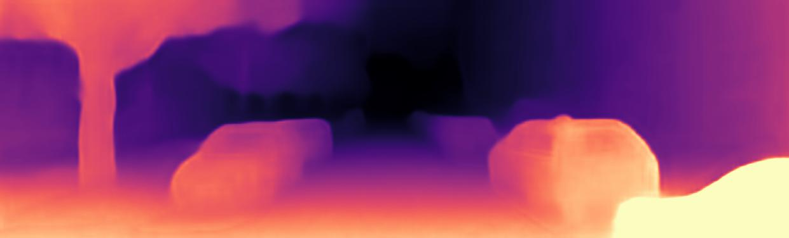 |

   - 定量测试.

     |      模型      | 是否median scale |  abs_rel  |  sq_rel   |   rmse    | rmse_log  |    a1     |    a2     |    a3     |     med     |     std     |
     | :------------: | :--------------: | :-------: | :-------: | :-------: | :-------: | :-------: | :-------: | :-------: | :---------: | :---------: |
     |   预训练模型   |        是        | **0.098** | **0.770** | **4.458** | **0.176** | **0.900** | **0.965** | **0.983** |   34.644    |    0.083    |
     | *位姿监督模型* |       *是*       |  *0.111*  |  *0.802*  |  *4.656*  |  *0.189*  |  *0.879*  |  *0.960*  |  *0.982*  | ***1.057*** | ***0.068*** |
     | *位姿监督模型* |       *否*       |  *0.117*  |  *0.828*  |  *4.842*  |  *0.204*  |  *0.861*  |  *0.954*  |  *0.979*  |     *-*     |     *-*     |
     |  PackNet M+v   |        否        |   0.111   |   0.829   |   4.788   |   0.199   |   0.864   |   0.954   |   0.980   |      -      |      -      |

     尺度是正确的, 精度还有待调整训练策略以提高. 跟PackNet加入位姿监督的结果已经非常接近了.

2. 查看损失函数的变化趋势.

   |    损失项    |               曲线图                |
   | :----------: | :---------------------------------: |
   | reprojection |  |
   |     pose     |          |
   | consistency  |   |
   |    total     |         |

   可以看到, 最后的误差中, 只有consistency是没有完全收敛. 该损失项是由不可靠的区域从多帧和单帧得到的深度差异导致的, 突然升高可以理解为单帧深度网络向真实尺度收敛, 如果单帧深度网络可靠, 那么consistency损失项收敛至0是最佳的.

3. 提前加入位姿监督(5~15轮). ~~(todo)~~

4. 车库数据集更新后训练. (todo)

## 2022/3/10

1. KITTI_RAW位姿监督20轮训练完成, 从第5轮开始加入位姿监督.

   - 定性测试.

     |                      |                Image                |
     | :------------------: | :---------------------------------: |
     |         原图         |             |
     |      预训练模型      |        |
     | 位姿监督模型 (10:15) |    |
     | 位姿监督模型 (05:15) | 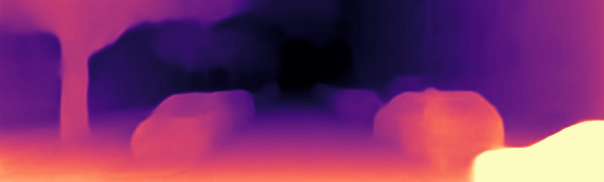 |

   - 定量测试.

     | 模型 (加入位姿监督轮次) | 是否median scale |  abs_rel  |  sq_rel   |   rmse    | rmse_log  |    a1     |    a2     |    a3     |    med    |    std    |
     | :---------------------: | :--------------: | :-------: | :-------: | :-------: | :-------: | :-------: | :-------: | :-------: | :-------: | :-------: |
     |       预训练模型        |        是        | **0.098** | **0.770** | **4.458** | **0.176** | **0.900** | **0.965** | **0.983** |  34.644   |   0.083   |
     |  位姿监督模型 (10:15)   |        是        |   0.111   |   0.802   |   4.656   |   0.189   |   0.879   |   0.960   |   0.982   | **1.057** | **0.068** |
     | *位姿监督模型 (05:15)*  |       *是*       |  *0.114*  |  *0.855*  |  *4.810*  |  *0.192*  |  *0.869*  |  *0.957*  |  *0.981*  |  *1.097*  |  *0.070*  |
     |       PackNet M+v       |        否        |   0.111   |   0.829   |   4.788   |   0.199   |   0.864   |   0.954   |   0.980   |     -     |     -     |

     结果变差, 继续调整策略. ~~(todo)~~

## 2022/3/14

1. KITTI_RAW位姿监督20轮训练完成, 从第0轮开始加入位姿监督.

   - 定性测试.

     |                      |                Image                |
     | :------------------: | :---------------------------------: |
     |         原图         |             |
     |      预训练模型      |        |
     | 位姿监督模型 (10:15) |    |
     | 位姿监督模型 (05:15) |  |
     | 位姿监督模型 (00:15) |  |

   - 定量测试.

     | 模型 (加入位姿监督轮次) | 是否median scale |  abs_rel  |  sq_rel   |   rmse    | rmse_log  |    a1     |    a2     |    a3     |     med     |    std    |
     | :---------------------: | :--------------: | :-------: | :-------: | :-------: | :-------: | :-------: | :-------: | :-------: | :---------: | :-------: |
     |       预训练模型        |        是        | **0.098** | **0.770** | **4.458** | **0.176** | **0.900** | **0.965** | **0.983** |   34.644    |   0.083   |
     |  位姿监督模型 (10:15)   |        是        |   0.111   |   0.802   |   4.656   |   0.189   |   0.879   |   0.960   |   0.982   |    1.057    | **0.068** |
     |  位姿监督模型 (05:15)   |        是        |   0.114   |   0.855   |   4.810   |   0.192   |   0.869   |   0.957   |   0.981   |    1.097    |   0.070   |
     | *位姿监督模型 (00:15)*  |       *是*       |  *0.125*  |  *0.950*  |  *4.966*  |  *0.200*  |  *0.856*  |  *0.955*  |  *0.980*  | ***1.042*** |  *0.076*  |
     |       PackNet M+v       |        否        |   0.111   |   0.829   |   4.788   |   0.199   |   0.864   |   0.954   |   0.980   |      -      |     -     |

     加入位姿监督轮次越早, 最终的结果越差. 尝试增加训练轮次或调整位姿网络的权重.

## 2022/3/15

1. 位姿监督不同策略尝试.

   1. KITTI_RAW位姿监督30轮训练.

   2. KITTI_RAW位姿监督20轮训练, 位姿监督损失项权重调整: 0.05->0.01.

      | 模型 (加入位姿监督轮次) | 是否median scale |  abs_rel  |  sq_rel   |   rmse    | rmse_log  |    a1     |    a2     |    a3     |    med    |    std    |
      | :---------------------: | :--------------: | :-------: | :-------: | :-------: | :-------: | :-------: | :-------: | :-------: | :-------: | :-------: |
      |       预训练模型        |        是        | **0.098** | **0.770** | **4.458** | **0.176** | **0.900** | **0.965** | **0.983** |  34.644   |   0.083   |
      |  位姿监督模型 (10:15)   |        是        |   0.111   |   0.802   |   4.656   |   0.189   |   0.879   |   0.960   |   0.982   |   1.057   | **0.068** |
      |  位姿监督模型 (05:15)   |        是        |   0.114   |   0.855   |   4.810   |   0.192   |   0.869   |   0.957   |   0.981   |   1.097   |   0.070   |
      |  位姿监督模型 (00:15)   |        是        |   0.125   |   0.950   |   4.966   |   0.200   |   0.856   |   0.955   |   0.980   | **1.042** |   0.076   |
      |  *位姿监督模型 (30轮)*  |       *是*       |  *0.110*  |  *0.810*  |  *4.771*  |  *0.191*  |  *0.876*  |  *0.958*  |  *0.981*  |  *1.088*  |  *0.065*  |
      |  *位姿监督模型 (0.01)*  |       *是*       |  *0.103*  |  *0.741*  |  *4.519*  |  *0.180*  |  *0.890*  |  *0.963*  |  *0.983*  | *12.865*  |  *0.095*  |
      |       PackNet M+v       |        否        |   0.111   |   0.829   |   4.788   |   0.199   |   0.864   |   0.954   |   0.980   |     -     |     -     |

      增加训练轮次带来的结果提升并不明显. 而调整权重大小之后, 尺度没有完全收敛到真实尺度, 意味着该权重太小. 可以再寻找中间的权重值. ~~(todo)~~

2. 损失函数中的consistency项在加入位姿监督后出现不稳定的现象, 可能要进行归一化的处理. ~~(todo)~~

## 2022/3/16

| 模型 (加入位姿监督轮次) | 是否median scale |  abs_rel  |  sq_rel   |   rmse    | rmse_log  |    a1     |    a2     |    a3     |    med    |    std    |
| :---------------------: | :--------------: | :-------: | :-------: | :-------: | :-------: | :-------: | :-------: | :-------: | :-------: | :-------: |
|       预训练模型        |        是        | **0.098** | **0.770** | **4.458** | **0.176** | **0.900** | **0.965** | **0.983** |  34.644   |   0.083   |
|  位姿监督模型 (10:15)   |        是        |   0.111   |   0.802   |   4.656   |   0.189   |   0.879   |   0.960   |   0.982   |   1.057   | **0.068** |
|  位姿监督模型 (05:15)   |        是        |   0.114   |   0.855   |   4.810   |   0.192   |   0.869   |   0.957   |   0.981   |   1.097   |   0.070   |
|  位姿监督模型 (00:15)   |        是        |   0.125   |   0.950   |   4.966   |   0.200   |   0.856   |   0.955   |   0.980   | **1.042** |   0.076   |
|   位姿监督模型 (30轮)   |        是        |   0.110   |   0.810   |   4.771   |   0.191   |   0.876   |   0.958   |   0.981   |   1.088   |   0.065   |
|   位姿监督模型 (0.01)   |        是        |   0.103   |   0.741   |   4.519   |   0.180   |   0.890   |   0.963   |   0.983   |  12.865   |   0.095   |
|  *位姿监督模型 (0.02)*  |       *是*       |  *0.109*  |  *0.853*  |  *4.747*  |  *0.186*  |  *0.880*  |  *0.960*  |  *0.982*  |  *1.091*  |  *0.067*  |
|       PackNet M+v       |        否        |   0.111   |   0.829   |   4.788   |   0.199   |   0.864   |   0.954   |   0.980   |     -     |     -     |

可以看到, `0.02`的权重可以使网络最终具有尺度.

## 2022/3/17

| 模型 (加入位姿监督轮次) | 是否median scale |  abs_rel  |  sq_rel   |   rmse    | rmse_log  |    a1     |    a2     |    a3     |    med    |    std    |
| :---------------------: | :--------------: | :-------: | :-------: | :-------: | :-------: | :-------: | :-------: | :-------: | :-------: | :-------: |
|       预训练模型        |        是        | **0.098** | **0.770** | **4.458** | **0.176** | **0.900** | **0.965** | **0.983** |  34.644   |   0.083   |
|  位姿监督模型 (10:15)   |        是        |   0.111   |   0.802   |   4.656   |   0.189   |   0.879   |   0.960   |   0.982   |   1.057   | **0.068** |
|  位姿监督模型 (05:15)   |        是        |   0.114   |   0.855   |   4.810   |   0.192   |   0.869   |   0.957   |   0.981   |   1.097   |   0.070   |
|  位姿监督模型 (00:15)   |        是        |   0.125   |   0.950   |   4.966   |   0.200   |   0.856   |   0.955   |   0.980   | **1.042** |   0.076   |
|   位姿监督模型 (30轮)   |        是        |   0.110   |   0.810   |   4.771   |   0.191   |   0.876   |   0.958   |   0.981   |   1.088   |   0.065   |
|   位姿监督模型 (0.01)   |        是        |   0.103   |   0.741   |   4.519   |   0.180   |   0.890   |   0.963   |   0.983   |  12.865   |   0.095   |
| *位姿监督模型 (0.015)*  |       *是*       |  *0.110*  |  *0.862*  |  *4.718*  |  *0.186*  |  *0.881*  |  *0.960*  |  *0.982*  |  *1.084*  |  *0.077*  |
|   位姿监督模型 (0.02)   |        是        |   0.109   |   0.853   |   4.747   |   0.186   |   0.880   |   0.960   |   0.982   |   1.091   |   0.067   |
|       PackNet M+v       |        否        |   0.111   |   0.829   |   4.788   |   0.199   |   0.864   |   0.954   |   0.980   |     -     |     -     |

可以看到, `0.015`的权重可以使网络最终具有尺度.

## 2022/3/18

1. 对损失函数进行了更改, 试图解决加入尺度后带来的突变问题.

   - 损失函数问题主要在consistency项.
   - 掩膜为mono_depth和cost_volume的argmin差异较大的部分.
   - 损失为掩膜区域mono_depth和multi_depth的绝对值误差.
   - 加入位姿监督的时候, 位姿获得尺度后, cost_volume的argmin也会马上获得尺度, 此时mono_depth还未获得尺度, 因此整张图都具有比较大的差异, 大块区域被计算该损失.
   - 通过进行归一化的操作消除尺度的问题. mono_depth和cost_volume的argmin都除以它们各自的均值.

2. 其它参数不变, 训练20轮.

   - 定性结果.

     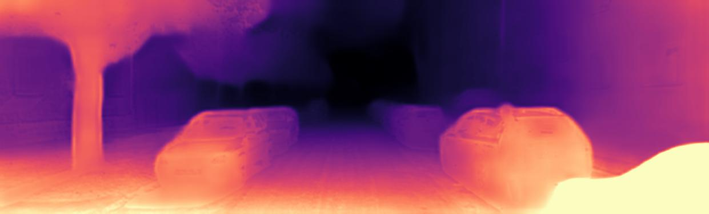

   - 定量结果.

     | 模型 (加入位姿监督轮次) | 是否median scale |  abs_rel  |  sq_rel   |   rmse    | rmse_log  |    a1     |    a2     |    a3     |    med    |    std    |
     | :---------------------: | :--------------: | :-------: | :-------: | :-------: | :-------: | :-------: | :-------: | :-------: | :-------: | :-------: |
     |       预训练模型        |        是        | **0.098** | **0.770** | **4.458** | **0.176** | **0.900** | **0.965** | **0.983** |  34.644   |   0.083   |
     |  位姿监督模型 (10:15)   |        是        |   0.111   |   0.802   |   4.656   |   0.189   |   0.879   |   0.960   |   0.982   |   1.057   | **0.068** |
     |  位姿监督模型 (05:15)   |        是        |   0.114   |   0.855   |   4.810   |   0.192   |   0.869   |   0.957   |   0.981   |   1.097   |   0.070   |
     |  位姿监督模型 (00:15)   |        是        |   0.125   |   0.950   |   4.966   |   0.200   |   0.856   |   0.955   |   0.980   | **1.042** |   0.076   |
     |   位姿监督模型 (30轮)   |        是        |   0.110   |   0.810   |   4.771   |   0.191   |   0.876   |   0.958   |   0.981   |   1.088   |   0.065   |
     |   位姿监督模型 (0.01)   |        是        |   0.103   |   0.741   |   4.519   |   0.180   |   0.890   |   0.963   |   0.983   |  12.865   |   0.095   |
     |  位姿监督模型 (0.015)   |        是        |   0.110   |   0.862   |   4.718   |   0.186   |   0.881   |   0.960   |   0.982   |   1.084   |   0.077   |
     |   位姿监督模型 (0.02)   |        是        |   0.109   |   0.853   |   4.747   |   0.186   |   0.880   |   0.960   |   0.982   |   1.091   |   0.067   |
     |  *位姿监督模型 (norm)*  |       *是*       |  *0.145*  |  *1.041*  |  *5.065*  |  *0.211*  |  *0.815*  |  *0.953*  |  *0.982*  | *22.040*  |  *0.184*  |
     |       PackNet M+v       |        否        |   0.111   |   0.829   |   4.788   |   0.199   |   0.864   |   0.954   |   0.980   |     -     |     -     |

     尺度消失了? 计算区域的时候不关心尺度, 最后结果也不关心尺度了.

3. 损失函数曲线. (todo)

   - 尺度0和其它尺度(2^1,2,3)不一样, 为什么?
   - 还需要钻研...

## 2022/3/21

1. 位姿监督损失项修改权重为0.03.

   | 模型 (加入位姿监督轮次) | 是否median scale |  abs_rel  |  sq_rel   |   rmse    | rmse_log  |    a1     |    a2     |    a3     |    med    |    std    |
   | :---------------------: | :--------------: | :-------: | :-------: | :-------: | :-------: | :-------: | :-------: | :-------: | :-------: | :-------: |
   |       预训练模型        |        是        | **0.098** | **0.770** | **4.458** | **0.176** | **0.900** | **0.965** | **0.983** |  34.644   |   0.083   |
   |  位姿监督模型 (10:15)   |        是        |   0.111   |   0.802   |   4.656   |   0.189   |   0.879   |   0.960   |   0.982   |   1.057   | **0.068** |
   |  位姿监督模型 (05:15)   |        是        |   0.114   |   0.855   |   4.810   |   0.192   |   0.869   |   0.957   |   0.981   |   1.097   |   0.070   |
   |  位姿监督模型 (00:15)   |        是        |   0.125   |   0.950   |   4.966   |   0.200   |   0.856   |   0.955   |   0.980   | **1.042** |   0.076   |
   |   位姿监督模型 (30轮)   |        是        |   0.110   |   0.810   |   4.771   |   0.191   |   0.876   |   0.958   |   0.981   |   1.088   |   0.065   |
   |   位姿监督模型 (0.01)   |        是        |   0.103   |   0.741   |   4.519   |   0.180   |   0.890   |   0.963   |   0.983   |  12.865   |   0.095   |
   |  位姿监督模型 (0.015)   |        是        |   0.110   |   0.862   |   4.718   |   0.186   |   0.881   |   0.960   |   0.982   |   1.084   |   0.077   |
   |   位姿监督模型 (0.02)   |        是        |   0.109   |   0.853   |   4.747   |   0.186   |   0.880   |   0.960   |   0.982   |   1.091   |   0.067   |
   |  *位姿监督模型 (0.03)*  |       *是*       |  *0.112*  |  *0.871*  |  *4.753*  |  *0.191*  |  *0.874*  |  *0.958*  |  *0.981*  |  *1.098*  |  *0.065*  |
   |   位姿监督模型 (norm)   |        是        |   0.145   |   1.041   |   5.065   |   0.211   |   0.815   |   0.953   |   0.982   |  22.040   |   0.184   |
   |       PackNet M+v       |        否        |   0.111   |   0.829   |   4.788   |   0.199   |   0.864   |   0.954   |   0.980   |     -     |     -     |

2. 对consistency项的一些思考.

   - consistency项增加还有一种可能, 就是具有尺度后, 误差也具有了相应的尺度. 原来(真值:估计值)=30, 现在是1, 损失应该增加30倍.

     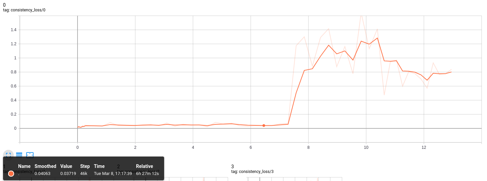

     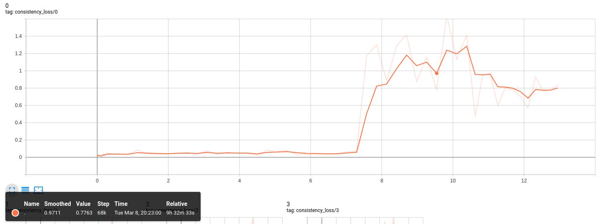

     可以看到1/0.04～=25. 上面的猜想比较可靠.

## 2022/3/22

1. 周会上详细讨论了consistency项的问题.
   - 不管从定性还是定量结果上看, consistency项最终没有收敛都没有严重影响最终的效果.
   - mono_depth的结果是否可靠, 以供multi_depth逼近. 将掩膜内的损失去掉试试. ~~(todo)~~
   - 是否使用不受尺度影响的损失项, 例如Eigen的尺度不变误差. 但是这样是否还能收敛到真实尺度上. (todo)

## 2022/3/24

1. 去掉掩膜内的损失, 其他参数不变训练20轮.

   - 定性结果.

     |                                |                 Image                 |
     | :----------------------------: | :-----------------------------------: |
     |              原图              |               |
     |           预训练模型           |          |
     |      位姿监督模型 (10:15)      |      |
     | 位姿监督模型 (w/o consistency) | 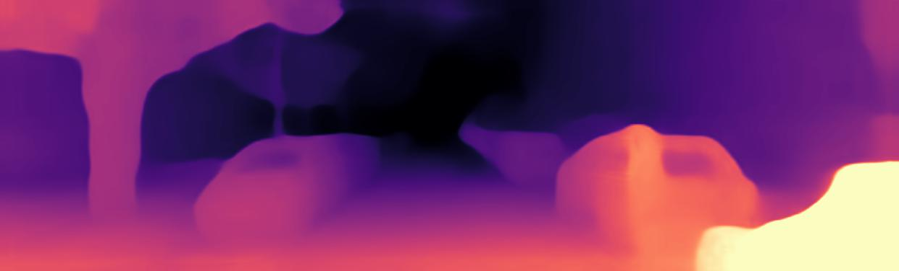 |

   - 定量结果.

     |     模型 (加入位姿监督轮次)      | 是否median scale |  abs_rel  |  sq_rel   |   rmse    | rmse_log  |    a1     |    a2     |    a3     |   med   |    std    |
     | :------------------------------: | :--------------: | :-------: | :-------: | :-------: | :-------: | :-------: | :-------: | :-------: | :-----: | :-------: |
     |            预训练模型            |        是        | **0.098** | **0.770** | **4.458** | **0.176** | **0.900** | **0.965** | **0.983** | 34.644  |   0.083   |
     |       位姿监督模型 (10:15)       |        是        |   0.111   |   0.802   |   4.656   |   0.189   |   0.879   |   0.960   |   0.982   |  1.057  | **0.068** |
     | *位姿监督模型 (w/o consistency)* |       *是*       |  *0.174*  |  *2.524*  |  *6.807*  |  *0.260*  |  *0.806*  |  *0.909*  |  *0.952*  | *1.080* |  *0.221*  |

2. 损失函数曲线.

   |    损失项    |             曲线图             |
   | :----------: | :----------------------------: |
   | reprojection | 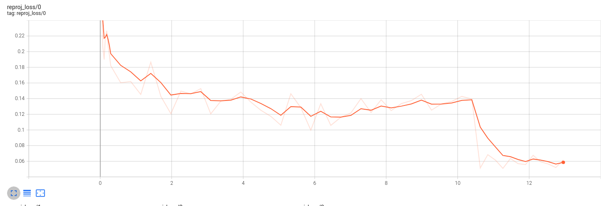 |
   | consistency  | 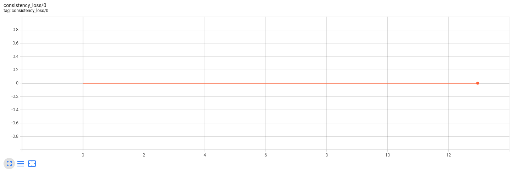  |
   |     pose     |          |
   |    total     |         |

3. 几个前进的方向.

   1. 权重比例调整. ~~(todo)~~ 权重的比例并没有变化很大, 调整应该没有效果.
   2. 给consistency项加入系数. ~~(todo, 正在训练)~~
   3. 查看加入尺度后的掩膜是否正确. (todo)
   4. consistency项在加入尺度之前能否收敛到0? (todo)

## 2022/3/25

1. 给consistency项加入系数. (加入尺度后除以30)

   |      模型 (加入位姿监督轮次)       | 是否median scale |  abs_rel  |  sq_rel   |   rmse    | rmse_log  |    a1     |    a2     |    a3     |    med    |    std    |
   | :--------------------------------: | :--------------: | :-------: | :-------: | :-------: | :-------: | :-------: | :-------: | :-------: | :-------: | :-------: |
   |             预训练模型             |        是        | **0.098** | **0.770** | **4.458** | **0.176** | **0.900** | **0.965** | **0.983** |  34.644   |   0.083   |
   |        位姿监督模型 (10:15)        |        是        |   0.111   |   0.802   |   4.656   |   0.189   |   0.879   |   0.960   |   0.982   |   1.057   | **0.068** |
   |        位姿监督模型 (05:15)        |        是        |   0.114   |   0.855   |   4.810   |   0.192   |   0.869   |   0.957   |   0.981   |   1.097   |   0.070   |
   |        位姿监督模型 (00:15)        |        是        |   0.125   |   0.950   |   4.966   |   0.200   |   0.856   |   0.955   |   0.980   | **1.042** |   0.076   |
   |        位姿监督模型 (30轮)         |        是        |   0.110   |   0.810   |   4.771   |   0.191   |   0.876   |   0.958   |   0.981   |   1.088   |   0.065   |
   |        位姿监督模型 (0.01)         |        是        |   0.103   |   0.741   |   4.519   |   0.180   |   0.890   |   0.963   |   0.983   |  12.865   |   0.095   |
   |        位姿监督模型 (0.015)        |        是        |   0.110   |   0.862   |   4.718   |   0.186   |   0.881   |   0.960   |   0.982   |   1.084   |   0.077   |
   |        位姿监督模型 (0.02)         |        是        |   0.109   |   0.853   |   4.747   |   0.186   |   0.880   |   0.960   |   0.982   |   1.091   |   0.067   |
   |        位姿监督模型 (0.03)         |        是        |   0.112   |   0.871   |   4.753   |   0.191   |   0.874   |   0.958   |   0.981   |   1.098   |   0.065   |
   |        位姿监督模型 (norm)         |        是        |   0.145   |   1.041   |   5.065   |   0.211   |   0.815   |   0.953   |   0.982   |  22.040   |   0.184   |
   | *位姿监督模型 (scale consistency)* |       *是*       |  *0.107*  |  *0.806*  |  *4.555*  |  *0.184*  |  *0.891*  |  *0.962*  |  *0.982*  |  *1.089*  |  *0.067*  |
   |            PackNet M+v             |        否        |   0.111   |   0.829   |   4.788   |   0.199   |   0.864   |   0.954   |   0.980   |     -     |     -     |

   效果有所提升. 查看了损失函数曲线, consistency项大体上是一个稳定的趋势.

   |    损失项    |             曲线图             |
   | :----------: | :----------------------------: |
   | reprojection | 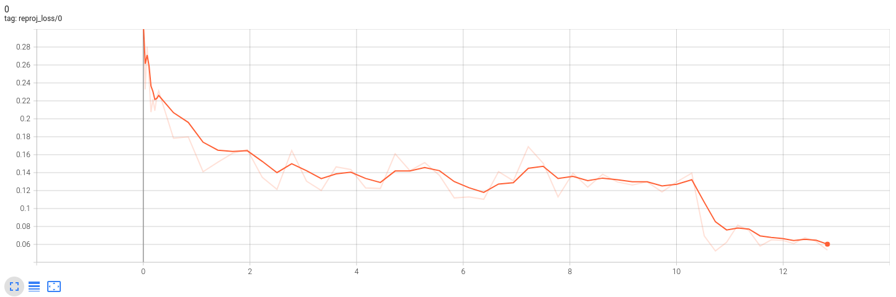 |
   |     pose     |          |
   | consistency  | 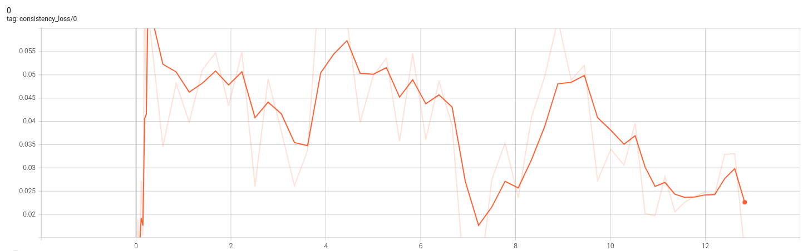  |
   |    total     |    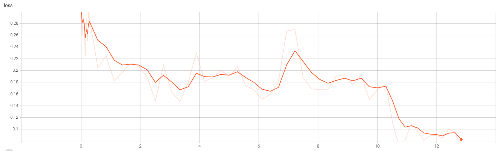     |

## 2022/3/27

1. 再次训练scale consistency, 以验证它的效果.

   |     模型 (加入位姿监督轮次)      | 是否median scale |  abs_rel  |  sq_rel   |   rmse    | rmse_log  |    a1     |    a2     |    a3     |    med    |    std    |
   | :------------------------------: | :--------------: | :-------: | :-------: | :-------: | :-------: | :-------: | :-------: | :-------: | :-------: | :-------: |
   |            预训练模型            |        是        | **0.098** | **0.770** | **4.458** | **0.176** | **0.900** | **0.965** | **0.983** |  34.644   |   0.083   |
   |       位姿监督模型 (10:15)       |        是        |   0.111   |   0.802   |   4.656   |   0.189   |   0.879   |   0.960   |   0.982   |   1.057   | **0.068** |
   |       位姿监督模型 (05:15)       |        是        |   0.114   |   0.855   |   4.810   |   0.192   |   0.869   |   0.957   |   0.981   |   1.097   |   0.070   |
   |       位姿监督模型 (00:15)       |        是        |   0.125   |   0.950   |   4.966   |   0.200   |   0.856   |   0.955   |   0.980   | **1.042** |   0.076   |
   |       位姿监督模型 (30轮)        |        是        |   0.110   |   0.810   |   4.771   |   0.191   |   0.876   |   0.958   |   0.981   |   1.088   |   0.065   |
   |       位姿监督模型 (0.01)        |        是        |   0.103   |   0.741   |   4.519   |   0.180   |   0.890   |   0.963   |   0.983   |  12.865   |   0.095   |
   |       位姿监督模型 (0.015)       |        是        |   0.110   |   0.862   |   4.718   |   0.186   |   0.881   |   0.960   |   0.982   |   1.084   |   0.077   |
   |       位姿监督模型 (0.02)        |        是        |   0.109   |   0.853   |   4.747   |   0.186   |   0.880   |   0.960   |   0.982   |   1.091   |   0.067   |
   |       位姿监督模型 (0.03)        |        是        |   0.112   |   0.871   |   4.753   |   0.191   |   0.874   |   0.958   |   0.981   |   1.098   |   0.065   |
   |       位姿监督模型 (norm)        |        是        |   0.145   |   1.041   |   5.065   |   0.211   |   0.815   |   0.953   |   0.982   |  22.040   |   0.184   |
   | 位姿监督模型 (scale consistency) |        是        |   0.107   |   0.806   |   4.555   |   0.184   |   0.891   |   0.962   |   0.982   |   1.089   |   0.067   |
   | 位姿监督模型 (scale consistency) |        是        |   0.110   |   0.806   |   4.760   |   0.190   |   0.877   |   0.958   |   0.981   |   1.069   |   0.065   |
   |           PackNet M+v            |        否        |   0.111   |   0.829   |   4.788   |   0.199   |   0.864   |   0.954   |   0.980   |     -     |     -     |

   不改变任何条件, 训练出来的结果也相差比较大.

2. consistency项在加入尺度之前能否收敛到0.

   - 损失函数.

     |    损失项    |             曲线图             |
     | :----------: | :----------------------------: |
     | reprojection | 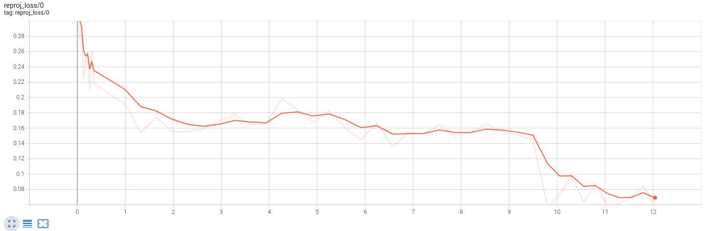 |
     |     pose     |     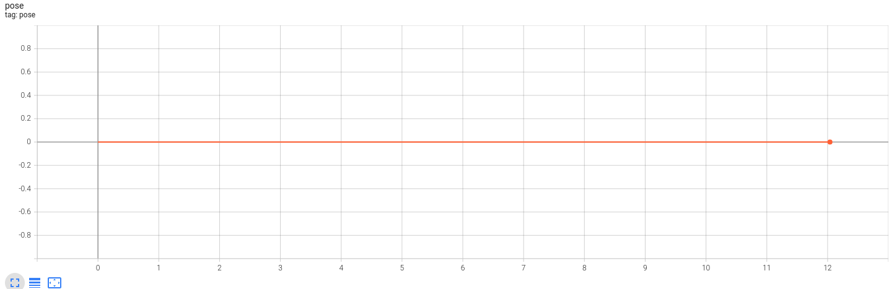     |
     | consistency  |   |
     |    total     |         |

     在对网络修改之前, consistency项也是在很小的数值左右浮动.

## 2022/3/29

1. 对单帧单目网络进行搭建, 从下至上进行多个消融实验.

2. 单帧单目网络训练20轮.

   - 定性结果.

     

   - 定量结果.

     |     模型 (加入位姿监督轮次)      | 是否median scale |  abs_rel  |  sq_rel   |   rmse    | rmse_log  |    a1     |    a2     |    a3     |    med    |   std   |
     | :------------------------------: | :--------------: | :-------: | :-------: | :-------: | :-------: | :-------: | :-------: | :-------: | :-------: | :-----: |
     |            预训练模型            |        是        | **0.098** | **0.770** | **4.458** | **0.176** | **0.900** | **0.965** | **0.983** |  34.644   |  0.083  |
     |       位姿监督模型 (10:15)       |        是        |   0.111   |   0.802   |   4.656   |   0.189   |   0.879   |   0.960   |   0.982   |   1.057   |  0.068  |
     |       位姿监督模型 (05:15)       |        是        |   0.114   |   0.855   |   4.810   |   0.192   |   0.869   |   0.957   |   0.981   |   1.097   |  0.070  |
     |       位姿监督模型 (00:15)       |        是        |   0.125   |   0.950   |   4.966   |   0.200   |   0.856   |   0.955   |   0.980   | **1.042** |  0.076  |
     |       位姿监督模型 (30轮)        |        是        |   0.110   |   0.810   |   4.771   |   0.191   |   0.876   |   0.958   |   0.981   |   1.088   |  0.065  |
     |       位姿监督模型 (0.01)        |        是        |   0.103   |   0.741   |   4.519   |   0.180   |   0.890   |   0.963   |   0.983   |  12.865   |  0.095  |
     |       位姿监督模型 (0.015)       |        是        |   0.110   |   0.862   |   4.718   |   0.186   |   0.881   |   0.960   |   0.982   |   1.084   |  0.077  |
     |       位姿监督模型 (0.02)        |        是        |   0.109   |   0.853   |   4.747   |   0.186   |   0.880   |   0.960   |   0.982   |   1.091   |  0.067  |
     |       位姿监督模型 (0.03)        |        是        |   0.112   |   0.871   |   4.753   |   0.191   |   0.874   |   0.958   |   0.981   |   1.098   |  0.065  |
     |       位姿监督模型 (norm)        |        是        |   0.145   |   1.041   |   5.065   |   0.211   |   0.815   |   0.953   |   0.982   |  22.040   |  0.184  |
     | 位姿监督模型 (scale consistency) |        是        |   0.107   |   0.806   |   4.555   |   0.184   |   0.891   |   0.962   |   0.982   |   1.089   |  0.067  |
     | 位姿监督模型 (scale consistency) |        是        |   0.110   |   0.806   |   4.760   |   0.190   |   0.877   |   0.958   |   0.981   |   1.069   |  0.065  |
     |      *位姿监督模型 (mono)*       |       *是*       |  *0.117*  |  *0.865*  |  *4.884*  |  *0.196*  |  *0.868*  |  *0.957*  |  *0.981*  | *30.510*  | *0.092* |
     |           PackNet M+v            |        否        |   0.111   |   0.829   |   4.788   |   0.199   |   0.864   |   0.954   |   0.980   |     -     |    -    |

     单帧单目的结果已经达到可以接受的程度.

3. 接下来做单帧单目位姿监督. ~~(todo)~~

## 2022/3/30

1. 单帧单目位姿监督.

   - 定量结果.

     |     模型 (加入位姿监督轮次)      | 是否median scale |  abs_rel  |  sq_rel   |   rmse    | rmse_log  |    a1     |    a2     |    a3     |    med    |  std  |
     | :------------------------------: | :--------------: | :-------: | :-------: | :-------: | :-------: | :-------: | :-------: | :-------: | :-------: | :---: |
     |            预训练模型            |        是        | **0.098** | **0.770** | **4.458** | **0.176** | **0.900** | **0.965** | **0.983** |  34.644   | 0.083 |
     |           复现训练模型           |        是        |   0.100   | **0.755** | **4.423** |   0.178   |   0.899   |   0.964   | **0.983** |     ?     |   ?   |
     |       位姿监督模型 (10:15)       |        是        |   0.111   |   0.802   |   4.656   |   0.189   |   0.879   |   0.960   |   0.982   |   1.057   | 0.068 |
     |       位姿监督模型 (05:15)       |        是        |   0.114   |   0.855   |   4.810   |   0.192   |   0.869   |   0.957   |   0.981   |   1.097   | 0.070 |
     |       位姿监督模型 (00:15)       |        是        |   0.125   |   0.950   |   4.966   |   0.200   |   0.856   |   0.955   |   0.980   | **1.042** | 0.076 |
     |       位姿监督模型 (30轮)        |        是        |   0.110   |   0.810   |   4.771   |   0.191   |   0.876   |   0.958   |   0.981   |   1.088   | 0.065 |
     |       位姿监督模型 (0.01)        |        是        |   0.103   |   0.741   |   4.519   |   0.180   |   0.890   |   0.963   |   0.983   |  12.865   | 0.095 |
     |       位姿监督模型 (0.015)       |        是        |   0.110   |   0.862   |   4.718   |   0.186   |   0.881   |   0.960   |   0.982   |   1.084   | 0.077 |
     |       位姿监督模型 (0.02)        |        是        |   0.109   |   0.853   |   4.747   |   0.186   |   0.880   |   0.960   |   0.982   |   1.091   | 0.067 |
     |       位姿监督模型 (0.03)        |        是        |   0.112   |   0.871   |   4.753   |   0.191   |   0.874   |   0.958   |   0.981   |   1.098   | 0.065 |
     |       位姿监督模型 (norm)        |        是        |   0.145   |   1.041   |   5.065   |   0.211   |   0.815   |   0.953   |   0.982   |  22.040   | 0.184 |
     | 位姿监督模型 (scale consistency) |        是        |   0.107   |   0.806   |   4.555   |   0.184   |   0.891   |   0.962   |   0.982   |   1.089   | 0.067 |
     | 位姿监督模型 (scale consistency) |        是        |   0.110   |   0.806   |   4.760   |   0.190   |   0.877   |   0.958   |   0.981   |   1.069   | 0.065 |
     |       位姿监督模型 (mono)        |        是        |   0.117   |   0.865   |   4.884   |   0.196   |   0.868   |   0.957   |   0.981   |  30.510   | 0.092 |
     |     位姿监督模型 (mono_sup)      |        是        |   0.117   |   0.894   |   4.889   |   0.195   |   0.868   |   0.957   |   0.980   |   1.083   | 0.068 |
     |           PackNet M+v            |        否        |   0.111   |   0.829   |   4.788   |   0.199   |   0.864   |   0.954   |   0.980   |     -     |   -   |

2. 步骤.

   1. 单帧.
   2. 单帧w/o Sup.
   3. 单帧w/o SSIM.
   4. 单帧w/o Mono mask.
   5. 多帧.
   6. 多帧w/o Sup.
   7. 多帧w/o Consistency mask.

## 2022/4/1

| 模型 (加入位姿监督轮次) | 是否median scale |  abs_rel  |  sq_rel   |   rmse    | rmse_log  |    a1     |    a2     |    a3     |  med   |  std  |
| :---------------------: | :--------------: | :-------: | :-------: | :-------: | :-------: | :-------: | :-------: | :-------: | :----: | :---: |
|       预训练模型        |        是        | **0.098** |   0.770   |   4.458   | **0.176** | **0.900** | **0.965** | **0.983** | 34.644 | 0.083 |
|      复现训练模型       |        是        |   0.100   |   0.755   | **4.423** |   0.178   |   0.899   |   0.964   | **0.983** | 33.075 | 0.089 |
|          mono           |        是        |   0.117   |   0.870   |   4.851   |   0.195   |   0.871   |   0.958   |   0.981   | 32.653 | 0.092 |
|     mono+sup(10:20)     |        是        |   0.117   |   0.894   |   4.889   |   0.195   |   0.868   |   0.957   |   0.980   | 1.083  | 0.068 |
|     mono+sup(05:20)     |        是        |   0.115   |   0.853   |   4.870   |   0.195   |   0.870   |   0.956   |   0.980   | 1.073  | 0.073 |
|     mono+sup(00:20)     |        是        |   0.116   |   0.866   |   4.897   |   0.194   |   0.869   |   0.957   |   0.980   | 1.082  | 0.071 |
|          multi          |        是        |   0.100   | **0.727** |   4.526   |   0.180   |   0.892   |   0.963   | **0.983** | 31.708 | 0.099 |
|    multi+sup(10:15)     |        是        |   0.101   |   0.748   |   4.658   |   0.183   |   0.887   |   0.961   |   0.982   | 1.074  | 0.062 |
|    multi+sup(05:15)     |        是        |   0.105   |   0.804   |   4.608   |   0.184   |   0.890   |   0.962   |   0.982   | 1.087  | 0.066 |
|    multi+sup(00:15)     |        是        |   0.105   |   0.811   |   4.699   |   0.186   |   0.887   |   0.960   |   0.982   | 1.102  | 0.067 |
|                         |                  |           |           |           |           |           |           |           |        |       |
|    multi+sup(10:15)     |        否        |   0.118   |   0.827   |   5.052   |   0.206   |   0.861   |   0.951   |   0.979   |   -    |   -   |
|       PackNet M+v       |        否        |   0.111   |   0.829   |   4.788   |   0.199   |   0.864   |   0.954   |   0.980   |   -    |   -   |

## 2022/4/6

| 模型 (加入位姿监督轮次) | 是否median scale |  abs_rel  |  sq_rel   |   rmse    | rmse_log  |    a1     |    a2     |    a3     |  med   |  std  |
| :---------------------: | :--------------: | :-------: | :-------: | :-------: | :-------: | :-------: | :-------: | :-------: | :----: | :---: |
|       预训练模型        |        是        | **0.098** |   0.770   |   4.458   | **0.176** | **0.900** | **0.965** | **0.983** | 34.644 | 0.083 |
|      复现训练模型       |        是        |   0.100   |   0.755   | **4.423** |   0.178   |   0.899   |   0.964   | **0.983** | 33.075 | 0.089 |
|          mono           |        是        |   0.117   |   0.870   |   4.851   |   0.195   |   0.871   |   0.958   |   0.981   | 32.653 | 0.092 |
|     mono+sup(10:20)     |        是        |   0.117   |   0.894   |   4.889   |   0.195   |   0.868   |   0.957   |   0.980   | 1.083  | 0.068 |
|     mono+sup(05:20)     |        是        |   0.115   |   0.853   |   4.870   |   0.195   |   0.870   |   0.956   |   0.980   | 1.073  | 0.073 |
|     mono+sup(00:20)     |        是        |   0.116   |   0.866   |   4.897   |   0.194   |   0.869   |   0.957   |   0.980   | 1.082  | 0.071 |
|          multi          |        是        |   0.100   | **0.727** |   4.526   |   0.180   |   0.892   |   0.963   | **0.983** | 31.708 | 0.099 |
|    multi+sup(10:15)     |        是        |   0.101   |   0.748   |   4.658   |   0.183   |   0.887   |   0.961   |   0.982   | 1.074  | 0.062 |
|    multi+sup(05:15)     |        是        |   0.105   |   0.804   |   4.608   |   0.184   |   0.890   |   0.962   |   0.982   | 1.087  | 0.066 |
|    multi+sup(00:15)     |        是        |   0.105   |   0.811   |   4.699   |   0.186   |   0.887   |   0.960   |   0.982   | 1.102  | 0.067 |
|   multi+sup(20:30)_40   |        是        |   0.102   |   0.836   |   4.722   |   0.185   |   0.891   |   0.961   |   0.981   | 1.083  | 0.062 |
|                         |                  |           |           |           |           |           |           |           |        |       |
|    multi+sup(10:15)     |        否        |   0.118   |   0.827   |   5.052   |   0.206   |   0.861   |   0.951   |   0.979   |   -    |   -   |
|       PackNet M+v       |        否        |   0.111   |   0.829   |   4.788   |   0.199   |   0.864   |   0.954   |   0.980   |   -    |   -   |

## 2022/4/7

1. 几方面要做的事.
   1. 加载pretrained, 然后加入尺度训练. ~~(todo)~~
   2. 查清楚PackNet的评价是否有median scale. (no)
   3. PackNet是否能融合多帧信息.
   4. Consistency的mask可视化记录.

## 2022/4/8

1. 加载pretrained, 然后加入尺度训练.

   - 结果, 复现训练模型即被加载微调的模型, 加载后在第0到5轮位姿监督训练PoseNet, 之后停止训练PoseNet再训练5轮, 总共10轮.

     | 模型 (加入位姿监督轮次) | 是否median scale |  abs_rel  | sq_rel |   rmse    | rmse_log  |    a1     |    a2     |    a3     |  med   |  std  |
     | :---------------------: | :--------------: | :-------: | :----: | :-------: | :-------: | :-------: | :-------: | :-------: | :----: | :---: |
     |       预训练模型        |        是        | **0.098** | 0.770  |   4.458   | **0.176** | **0.900** | **0.965** | **0.983** | 34.644 | 0.083 |
     |      复现训练模型       |        是        |   0.100   | 0.755  | **4.423** |   0.178   |   0.899   |   0.964   | **0.983** | 33.075 | 0.089 |
     | multi+pre+sup(00:05)_10 |        是        |   0.104   | 0.833  |   4.628   |   0.184   |   0.894   |   0.962   |   0.981   | 1.092  | 0.065 |
     |    multi+sup(10:15)     |        是        |   0.101   | 0.748  |   4.658   |   0.183   |   0.887   |   0.961   |   0.982   | 1.074  | 0.062 |

     效果(第3行)比pretrain(第2行)的效果差, 与不加载预训练方式(第4行)相比不相上下.

2. 查清楚PackNet的评价是否有median scale.

   - 论文中写得很清楚, 全监督方法和加入位姿监督方法在评价时均没有使用中值尺度放缩.

3. PackNet的部署还需要花费较大的精力.

## 2022/4/9

1. 写了一个比较全面的定性测试脚本, 包含以下内容.

   1. 单帧网络稠密深度图.
   2. 多帧网络稠密深度图.
   3. 单帧网络掩膜(mono reprojection mask).
   4. 多帧网络掩膜(consistency mask).
   5. 单帧网络变形图像(使用单帧深度和位姿变换得到).
   6. 多帧网络变形图像(使用多帧深度和位姿变换得到).

2. 结果示例.

   |        项目        |                      结果                      |                             备注                             |
   | :----------------: | :--------------------------------------------: | :----------------------------------------------------------: |
   |       Target       |           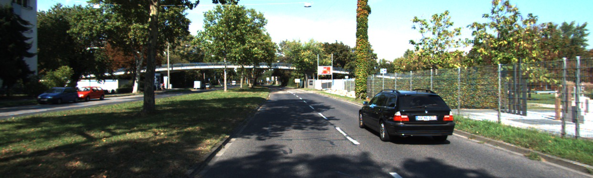            |                            t时刻                             |
   |       Source       |                       |                           t-1时刻                            |
   | 单帧网络稠密深度图 |         |             右侧的围栏和远处的树叶被理解为了树木             |
   | 多帧网络稠密深度图 |    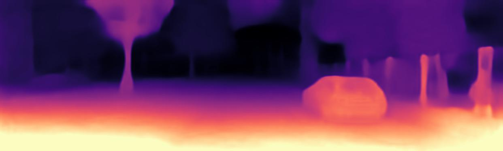    |                     多帧解决了这个"误解"                     |
   |    单帧网络掩膜    |    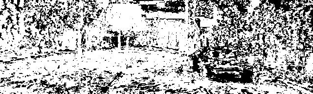     | 黑色(数值为0)为被mono depth认为是移动或遮挡物体$\mu=[L_p(I_t,I_{t'\rightarrow t})<L_p(I_t,I_{t'})]$ |
   |    多帧网络掩膜    |  | 白色(数值为1)为mono与cost volume不一致的区域, 认为是移动或遮挡物体$M=max(\frac{D_{cv}-D_{\hat{t}}}{D_{\hat{t}}},\frac{D_{\hat{t}}-D_{cv}}{D_{cv}})>1$ |
   |  单帧网络变形图像  |   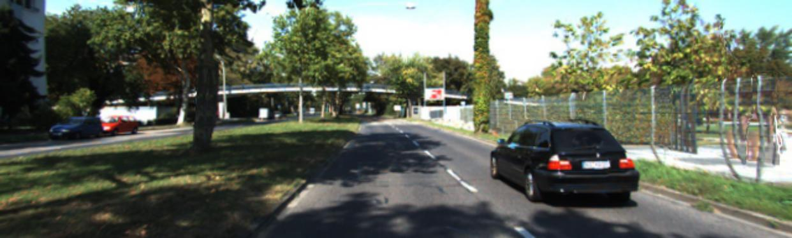    |                将Source投影到Target上计算误差                |
   |  多帧网络变形图像  |      |                                                              |

   |        项目        |                      结果                      |                             备注                             |
   | :----------------: | :--------------------------------------------: | :----------------------------------------------------------: |
   |       Target       |           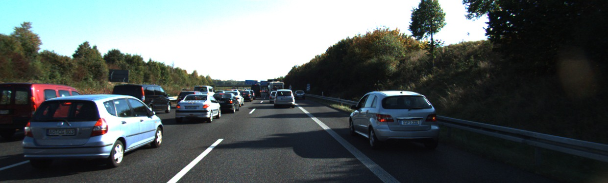            |       t时刻, 左侧车几乎不动, 右侧应急车道的车快速移动        |
   |       Source       |                       |                           t-1时刻                            |
   | 单帧网络稠密深度图 |    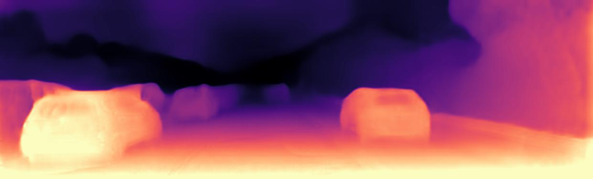     |                                                              |
   | 多帧网络稠密深度图 |    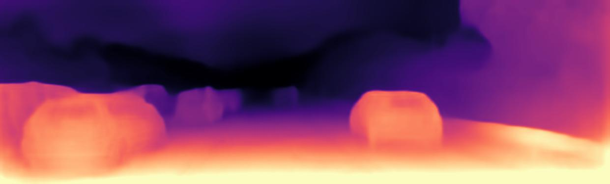    |                       左侧的车效果不好                       |
   |    单帧网络掩膜    |         | 黑色(数值为0)为被mono depth认为是移动或遮挡物体, 右侧的车符合预期$\mu=[L_p(I_t,I_{t'\rightarrow t})<L_p(I_t,I_{t'})]$ |
   |    多帧网络掩膜    | 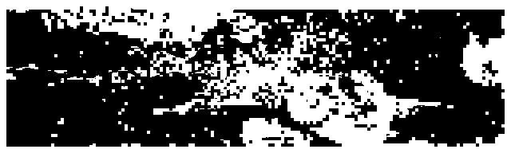 | 白色(数值为1)为mono与cost volume不一致的区域, 认为是移动或遮挡物体, 右侧区域面积较大$M=max(\frac{D_{cv}-D_{\hat{t}}}{D_{\hat{t}}},\frac{D_{\hat{t}}-D_{cv}}{D_{cv}})>1$ |
   |  单帧网络变形图像  |   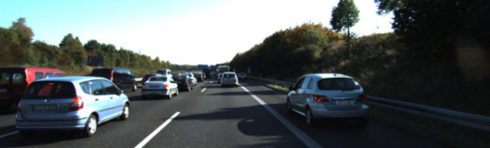    |                将Source投影到Target上计算误差                |
   |  多帧网络变形图像  |   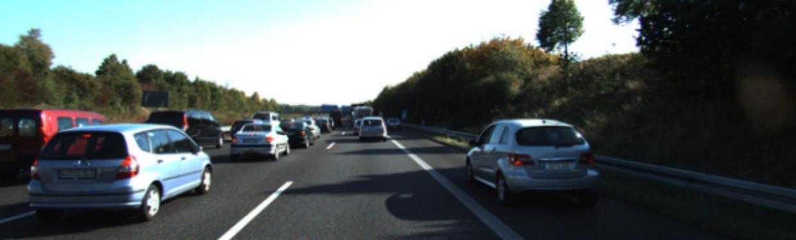   |                                                              |

   可以看到, 多帧确实可以利用更多的信息, 同时各种掩膜运作正常, 但还不够细致.

## 2022/4/11

1. 训练结果.

   | 模型 (加入位姿监督轮次) | 是否median scale |   abs_rel    |    sq_rel    |     rmse     |   rmse_log   |      a1      |      a2      |      a3      |  med   |  std  |
   | :---------------------: | :--------------: | :----------: | :----------: | :----------: | :----------: | :----------: | :----------: | :----------: | :----: | :---: |
   |       预训练模型        |        是        |  **0.098**   |    0.770     | <u>4.458</u> |  **0.176**   |  **0.900**   |  **0.965**   |  **0.983**   | 34.644 | 0.083 |
   |      复现训练模型       |        是        | <u>0.100</u> | <u>0.755</u> |  **4.423**   | <u>0.178</u> | <u>0.899</u> | <u>0.964</u> |  **0.983**   | 33.075 | 0.089 |
   | multi+pre+sup(00:05)_10 |        是        |    0.104     |    0.833     |    4.628     |    0.184     |    0.894     |    0.962     |    0.981     | 1.092  | 0.065 |
   | multi+pre+sup(00:03)_10 |        是        |    0.103     |    0.774     |    4.585     |    0.183     |    0.890     |    0.961     | <u>0.982</u> | 1.082  | 0.068 |
   |    multi+sup(10:15)     |        是        |    0.101     |  **0.748**   |    4.658     |    0.183     |    0.887     |    0.961     | <u>0.982</u> | 1.074  | 0.062 |
   |    multi+sup(12:15)     |        是        |    0.102     |    0.766     |    4.606     |    0.182     |    0.890     |    0.962     | <u>0.982</u> | 1.082  | 0.065 |

2. Pose评价.

   |       模型       |  ate  |  std  | split  |
   | :--------------: | :---: | :---: | :----: |
   |    预训练模型    | 0.019 | 0.009 | odom_9 |
   |   复现训练模型   | 0.019 | 0.008 | odom_9 |
   | multi+sup(10:15) | 0.020 | 0.009 | odom_9 |

   注意, 这里只是粗略地测试, 真正的测试应该使用KITTI_ODOM训练的模型进行.


## 2022/4/12

1. 修改数据读取方式. ~~(todo)~~
2. 掩膜的继续研究, 加入实例分割? (todo)
3. doing 10:14.

## 2022/4/13

| 模型 (加入位姿监督轮次) | 是否median scale |   abs_rel    |    sq_rel    |     rmse     |   rmse_log   |      a1      |      a2      |      a3      |  med   |  std  |
| :---------------------: | :--------------: | :----------: | :----------: | :----------: | :----------: | :----------: | :----------: | :----------: | :----: | :---: |
|       预训练模型        |        是        |  **0.098**   |    0.770     | <u>4.458</u> |  **0.176**   |  **0.900**   |  **0.965**   |  **0.983**   | 34.644 | 0.083 |
|      复现训练模型       |        是        | <u>0.100</u> | <u>0.755</u> |  **4.423**   | <u>0.178</u> | <u>0.899</u> | <u>0.964</u> |  **0.983**   | 33.075 | 0.089 |
| multi+pre+sup(00:05)_10 |        是        |    0.104     |    0.833     |    4.628     |    0.184     |    0.894     |    0.962     |    0.981     | 1.092  | 0.065 |
| multi+pre+sup(00:03)_10 |        是        |    0.103     |    0.774     |    4.585     |    0.183     |    0.890     |    0.961     | <u>0.982</u> | 1.082  | 0.068 |
|    multi+sup(10:15)     |        是        |    0.101     |  **0.748**   |    4.658     |    0.183     |    0.887     |    0.961     | <u>0.982</u> | 1.074  | 0.062 |
|    multi+sup(12:15)     |        是        |    0.102     |    0.766     |    4.606     |    0.182     |    0.890     |    0.962     | <u>0.982</u> | 1.082  | 0.065 |
|    multi+sup(14:15)     |        是        |    0.106     |    0.819     |    4.755     |    0.187     |    0.884     |    0.960     | <u>0.982</u> | 1.073  | 0.06  |

## 2022/4/14

1. 更改数据读取方式后, 从第0轮加入位姿监督, 结果如下.

   | 模型 (加入位姿监督轮次) | 是否median scale |   abs_rel    |    sq_rel    |     rmse     |   rmse_log   |      a1      |      a2      |      a3      |  med   |  std  |
   | :---------------------: | :--------------: | :----------: | :----------: | :----------: | :----------: | :----------: | :----------: | :----------: | :----: | :---: |
   |       预训练模型        |        是        |  **0.098**   |    0.770     | <u>4.458</u> |  **0.176**   |  **0.900**   |  **0.965**   |  **0.983**   | 34.644 | 0.083 |
   |      复现训练模型       |        是        |    0.100     | <u>0.755</u> |  **4.423**   | <u>0.178</u> | <u>0.899</u> | <u>0.964</u> |  **0.983**   | 33.075 | 0.089 |
   |    multi+sup(10:15)     |        是        |    0.101     |  **0.748**   |    4.658     |    0.183     |    0.887     |    0.961     | <u>0.982</u> | 1.074  | 0.062 |
   |    multi+sup(12:15)     |        是        |    0.102     |    0.766     |    4.606     |    0.182     |    0.890     |    0.962     | <u>0.982</u> | 1.082  | 0.065 |
   |    multi+sup(14:15)     |        是        |    0.106     |    0.819     |    4.755     |    0.187     |    0.884     |    0.960     | <u>0.982</u> | 1.073  | 0.069 |
   |                         |                  |              |              |              |              |              |              |              |        |       |
   |  multi+sup(00:15)_ old  |        是        |    0.105     |    0.811     |    4.699     |    0.186     |    0.887     |    0.960     | <u>0.982</u> | 1.102  | 0.067 |
   |  multi+sup(00:15)_new   |        是        | <u>0.099</u> |    0.760     |    4.513     | <u>0.178</u> |    0.896     |    0.963     |  **0.983**   | 1.049  | 0.061 |

   与之前的方式对比有了大幅提升, 由于数据读取的方式变化节省内存, batch_size可以增大, 同时按照与论文一致的split方法选取数据进行训练. 再测试10轮加入位姿监督. (todo)

2. KITTI_SEMANTICS的数据太少, 而且只有少量连续, 如何利用还是个问题. ~~(todo)~~ 用实例分割网络生成. 

## 2022/4/15

| 模型 (加入位姿监督轮次) | 是否median scale |   abs_rel    |    sq_rel    |     rmse     |   rmse_log   |      a1      |      a2      |      a3      |  med   |  std  |
| :---------------------: | :--------------: | :----------: | :----------: | :----------: | :----------: | :----------: | :----------: | :----------: | :----: | :---: |
|       预训练模型        |        是        |  **0.098**   |    0.770     | <u>4.458</u> |  **0.176**   |  **0.900**   |  **0.965**   |  **0.983**   | 34.644 | 0.083 |
|      复现训练模型       |        是        |    0.100     | <u>0.755</u> |  **4.423**   | <u>0.178</u> | <u>0.899</u> | <u>0.964</u> |  **0.983**   | 33.075 | 0.08  |
|    multi+sup(12:15)     |        是        |    0.102     |    0.766     |    4.606     |    0.182     |    0.890     |    0.962     | <u>0.982</u> | 1.082  | 0.065 |
|    multi+sup(14:15)     |        是        |    0.106     |    0.819     |    4.755     |    0.187     |    0.884     |    0.960     | <u>0.982</u> | 1.073  | 0.069 |
|                         |                  |              |              |              |              |              |              |              |        |       |
|  multi+sup(00:15)_ old  |        是        |    0.105     |    0.811     |    4.699     |    0.186     |    0.887     |    0.960     | <u>0.982</u> | 1.102  | 0.067 |
|  multi+sup(00:15)_new   |        是        | <u>0.099</u> |    0.760     |    4.513     | <u>0.178</u> |    0.896     |    0.963     |  **0.983**   | 1.049  | 0.061 |
|                         |                  |              |              |              |              |              |              |              |        |       |
|  multi+sup(05:15)_ old  |        是        |    0.105     |    0.804     |    4.608     |    0.184     |    0.890     |    0.962     |    0.982     | 1.087  | 0.066 |
|  multi+sup(05:15)_new   |        是        |    0.099     |    0.780     |    4.571     |    0.180     |    0.896     |    0.963     |    0.982     | 1.069  | 0.065 |
|                         |                  |              |              |              |              |              |              |              |        |       |
|  multi+sup(10:15)_ old  |        是        |    0.101     |  **0.748**   |    4.658     |    0.183     |    0.887     |    0.961     | <u>0.982</u> | 1.074  | 0.062 |
|  multi+sup(10:15)_new   |        是        |    0.101     |    0.761     |    4.543     |    0.181     |    0.894     |    0.963     | <u>0.982</u> | 1.075  | 0.065 |
|                         |                  |              |              |              |              |              |              |              |        |       |
|  mono+sup(00:20)_ old   |        是        |    0.116     |    0.866     |    4.897     |    0.194     |    0.869     |    0.957     |    0.980     | 1.082  | 0.071 |
|   mono+sup(00:20)_new   |        是        |    0.112     |    0.867     |    4.796     |    0.190     |    0.877     |    0.959     |    0.981     | 1.068  | 0.069 |
|                         |                  |              |              |              |              |              |              |              |        |       |
|  mono+sup(05:20)_ old   |        是        |    0.115     |    0.853     |    4.870     |    0.195     |    0.870     |    0.956     |    0.980     | 1.073  | 0.073 |
|   mono+sup(05:20)_new   |        是        |    0.111     |    0.858     |    4.839     |    0.190     |    0.879     |    0.959     |    0.981     | 1.079  | 0.066 |
|                         |                  |              |              |              |              |              |              |              |        |       |
|  mono+sup(10:20)_ old   |        是        |    0.117     |    0.894     |    4.889     |    0.195     |    0.868     |    0.957     |    0.980     | 1.083  | 0.068 |
|   mono+sup(10:20)_new   |        是        |    0.112     |    0.881     |    4.811     |    0.191     |    0.877     |    0.959     |    0.981     | 1.068  | 0.066 |

## 2022/4/18

1. 还在配置实例分割网络.

## 2022/4/19

1. 周会上明确了实例分割使用YOLACT.

## 日志转移到monoscaledepth更新

## 2022/4/20

1. YOLACT可以通过单张图像输出结果.

   

2. 接下来看如何分离不同实例, 以及批量处理和读取的问题. ~~(todo)~~

## 2022/4/21

| 模型 (加入位姿监督轮次) | 是否median scale |   abs_rel    |    sq_rel    |     rmse     |   rmse_log   |      a1      |      a2      |      a3      |  med   |  std  |
| :---------------------: | :--------------: | :----------: | :----------: | :----------: | :----------: | :----------: | :----------: | :----------: | :----: | :---: |
|       预训练模型        |        是        |  **0.098**   |    0.770     | <u>4.458</u> |  **0.176**   |  **0.900**   |  **0.965**   |  **0.983**   | 34.644 | 0.083 |
|      复现训练模型       |        是        |    0.100     | <u>0.755</u> |  **4.423**   | <u>0.178</u> | <u>0.899</u> | <u>0.964</u> |  **0.983**   | 33.075 | 0.08  |
|    multi+sup(12:15)     |        是        |    0.102     |    0.766     |    4.606     |    0.182     |    0.890     |    0.962     | <u>0.982</u> | 1.082  | 0.065 |
|    multi+sup(14:15)     |        是        |    0.106     |    0.819     |    4.755     |    0.187     |    0.884     |    0.960     | <u>0.982</u> | 1.073  | 0.069 |
|                         |                  |              |              |              |              |              |              |              |        |       |
|  multi+sup(00:15)_ old  |        是        |    0.105     |    0.811     |    4.699     |    0.186     |    0.887     |    0.960     | <u>0.982</u> | 1.102  | 0.067 |
|  multi+sup(00:15)_new   |        是        | <u>0.099</u> |    0.760     |    4.513     | <u>0.178</u> |    0.896     |    0.963     |  **0.983**   | 1.049  | 0.061 |
|                         |                  |              |              |              |              |              |              |              |        |       |
|  multi+sup(05:15)_ old  |        是        |    0.105     |    0.804     |    4.608     |    0.184     |    0.890     |    0.962     |    0.982     | 1.087  | 0.066 |
|  multi+sup(05:15)_new   |        是        |    0.099     |    0.780     |    4.571     |    0.180     |    0.896     |    0.963     |    0.982     | 1.069  | 0.065 |
|                         |                  |              |              |              |              |              |              |              |        |       |
|  multi+sup(10:15)_ old  |        是        |    0.101     |  **0.748**   |    4.658     |    0.183     |    0.887     |    0.961     | <u>0.982</u> | 1.074  | 0.062 |
|  multi+sup(10:15)_new   |        是        |    0.101     |    0.761     |    4.543     |    0.181     |    0.894     |    0.963     | <u>0.982</u> | 1.075  | 0.065 |
|                         |                  |              |              |              |              |              |              |              |        |       |
|  mono+sup(00:20)_ old   |        是        |    0.116     |    0.866     |    4.897     |    0.194     |    0.869     |    0.957     |    0.980     | 1.082  | 0.071 |
|   mono+sup(00:20)_new   |        是        |    0.112     |    0.867     |    4.796     |    0.190     |    0.877     |    0.959     |    0.981     | 1.068  | 0.069 |
|                         |                  |              |              |              |              |              |              |              |        |       |
|  mono+sup(05:20)_ old   |        是        |    0.115     |    0.853     |    4.870     |    0.195     |    0.870     |    0.956     |    0.980     | 1.073  | 0.073 |
|   mono+sup(05:20)_new   |        是        |    0.111     |    0.858     |    4.839     |    0.190     |    0.879     |    0.959     |    0.981     | 1.079  | 0.066 |
|                         |                  |              |              |              |              |              |              |              |        |       |
|  mono+sup(10:20)_ old   |        是        |    0.117     |    0.894     |    4.889     |    0.195     |    0.868     |    0.957     |    0.980     | 1.083  | 0.068 |
|   mono+sup(10:20)_new   |        是        |    0.112     |    0.881     |    4.811     |    0.191     |    0.877     |    0.959     |    0.981     | 1.068  | 0.066 |
|                         |                  |              |              |              |              |              |              |              |        |       |
|   multi+sup(00:20)_30   |        是        |    0.102     |    0.892     |    4.697     |    0.182     |    0.895     |    0.962     |    0.981     | 1.066  | 0.061 |
|                         |                  |              |              |              |              |              |              |              |        |       |
|   multi+sup(00:15)_20   |        是        | <u>0.099</u> |    0.760     |    4.513     | <u>0.178</u> |    0.896     |    0.963     |  **0.983**   | 1.049  | 0.061 |
|   multi+sup(00:15)_40   |        是        |    0.102     |    0.803     |    4.604     |    0.182     |    0.890     |    0.962     |    0.982     | 1.061  | 0.066 |
|                         |                  |              |              |              |              |              |              |              |        |       |
|   multi+sup(10:15)_20   |        是        |    0.101     |    0.761     |    4.543     |    0.181     |    0.894     |    0.963     | <u>0.982</u> | 1.075  | 0.065 |
|   multi+sup(10:15)_40   |        是        |    0.100     |    0.769     |    4.540     |    0.180     |    0.894     |    0.963     |    0.982     | 1.074  | 0.062 |

## 2022/4/23

1. 仍在继续弄实例分割.

2. 使用kitti_odom中的序列0~8训练模型, 在9, 10上测试得到结果.

   |         模型         |     ate      |     std      |  split  |
   | :------------------: | :----------: | :----------: | :-----: |
   |      预训练模型      | <u>0.019</u> |    0.009     | odom_9  |
   |     复现训练模型     | <u>0.019</u> | <u>0.008</u> | odom_9  |
   |   multi+sup(10:15)   |    0.020     |    0.009     | odom_9  |
   | mult+sup(00:15)_odom |  **0.015**   | <u>0.008</u> | odom_9  |
   | mult+sup(10:15)_odom |  **0.015**   |  **0.007**   | odom_9  |
   |                      |              |              |         |
   |      预训练模型      |  **0.014**   |    0.010     | odom_10 |
   |     复现训练模型     |  **0.014**   |    0.010     | odom_10 |
   |   multi+sup(10:15)   |    0.020     |    0.010     | odom_10 |
   | mult+sup(00:15)_odom |    0.016     |    0.010     | odom_10 |
   | mult+sup(10:15)_odom | <u>0.015</u> |  **0.009**   | odom_10 |

## 2022/4/24

1. 正在批量生成数据, 一张图片以置信度0.85为阈值, 产生10MB以下的数据. (由于存储空间有限, 只能提高阈值)

2. 只保存和读取class和mask两个结果, 其中 $class \in R^n, masks \in R^{n\times h\times w}$.

3. 示例.

   

   

   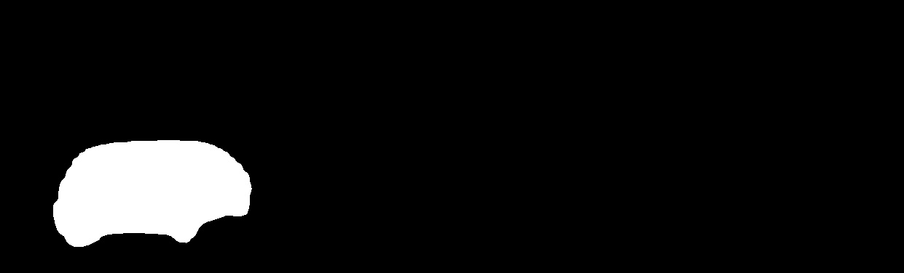

   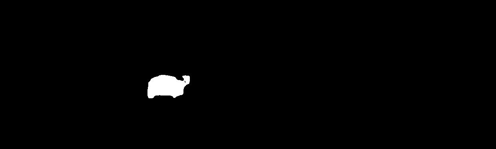

   

   


## 2022/4/25

1. KITTIRawPoseSemanticDataset -> MonoDataset读取mask.
2. compute losses中将mask替换. ~~(todo)~~
3. mask尺寸不一致: (375, 1242, 3), (370, 1226, 3), (374, 1238, 3), (376, 1241, 3). ~~(todo)~~
4. 直接用掩膜代替多帧中的consistency_mask.

## 2022/4/26

1. 接下来要做的事情.
   1. 保留原mask, 判断各实例掩膜动静态, 如果是动态则原mask直接或上实例, 否则与上(1-实例).
   2. 不加位姿监督在kitti_odom上的训练, 控制变量对比评价odom效果.
   3. 调整模型复杂度, 从ResNet18提升到34, 看是否有性能上的突破.

## 2022/4/29

1. 保留原mask, 判断各实例掩膜动静态, 如果是动态则原mask直接或上实例, 否则与上(1-实例).

   |      模型 (加入位姿监督轮次)      | 是否median scale |   abs_rel    |    sq_rel    |     rmse     |   rmse_log   |      a1      |      a2      |    a3     |  med   |  std  |
   | :-------------------------------: | :--------------: | :----------: | :----------: | :----------: | :----------: | :----------: | :----------: | :-------: | :----: | :---: |
   |            预训练模型             |        是        | <u>0.098</u> |    0.770     | <u>4.458</u> |  **0.176**   |  **0.900**   |  **0.965**   | **0.983** | 34.644 | 0.083 |
   |           复现训练模型            |        是        |    0.100     | <u>0.755</u> |  **4.423**   | <u>0.178</u> | <u>0.899</u> | <u>0.964</u> | **0.983** | 33.075 | 0.08  |
   |        multi+sup(00:15)_20        |        是        |    0.099     |    0.760     |    4.513     | <u>0.178</u> |    0.896     |    0.963     | **0.983** | 1.049  | 0.061 |
   |   multi+sup+semantics(00:15)_20   |        是        |    0.099     |    0.802     |    4.564     | <u>0.178</u> |    0.898     | <u>0.964</u> | **0.983** | 1.067  | 0.063 |
   |   multi+sup+semantics(00:15)_20   |        是        |    0.101     |    0.778     |    4.464     |    0.179     |    0.895     | <u>0.964</u> | **0.983** | 1.064  | 0.061 |
   | multi+sup+semantics+pre(00:15)_20 |        是        | <u>0.098</u> |    0.801     |    4.531     |    0.180     |  **0.900**   |    0.962     |   0.982   | 1.067  | 0.059 |
   | multi+sup+semantics+pre(00:15)_20 |        是        |  **0.096**   |  **0.749**   |    4.476     |    0.179     |  **0.900**   |    0.963     |   0.982   | 1.073  | 0.062 |

2. 不加位姿监督在kitti_odom上的训练, 控制变量对比评价odom效果.

   |       模型       | dataset |     ate      |     std      |  split  |
   | :--------------: | :-----: | :----------: | :----------: | :-----: |
   |    预训练模型    |   raw   | <u>0.019</u> |    0.009     | odom_9  |
   |   复现训练模型   |   raw   | <u>0.019</u> | <u>0.008</u> | odom_9  |
   | multi+sup(10:15) |   raw   |    0.020     |    0.009     | odom_9  |
   |   复现训练模型   |  odom   |    0.018     |    0.009     | odom_9  |
   | mult+sup(10:15)  |  odom   |  **0.015**   |  **0.007**   | odom_9  |
   |                  |         |              |              |         |
   |    预训练模型    |   raw   |  **0.014**   |    0.010     | odom_10 |
   |   复现训练模型   |   raw   |  **0.014**   |    0.010     | odom_10 |
   | multi+sup(10:15) |   raw   |    0.020     |    0.010     | odom_10 |
   |   复现训练模型   |  odom   |    0.015     |    0.010     | odom_10 |
   | mult+sup(10:15)  |  odom   | <u>0.015</u> |  **0.009**   | odom_10 |


## 2022/5/9

1. 计划.
   1. 在这周完成整篇论文, 目前已经剩下位姿监督, 实例分割, 实验和总结.
   2. 实验部分可能需要部署所有对比方法的代码, 以取得他们模型的定性结果.
   3. 实验部分的初步设想.
      1. 点云.
      2. k帧估计(?).
      3. Cost Volume插值方式(?).
      4. 多种网络结构.
         1. 单帧无位姿监督.
         2. 单帧有位姿监督.
         3. 多帧无位姿监督.
         4. 多帧有位姿监督.
      5. 实例分割效果.
      6. 里程计效果.
