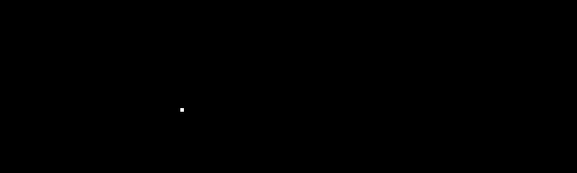

# Weekly

## Week 1

因为这种开始时还在摸索，没有定这一周的计划。因此这一周只做总结。

1. 论文
   1. **ManyDepth**: *The Temporal Opportunist: Self-Supervised Multi-Frame Monocular Depth*.
   2. **MonoDepth2**: *Digging Into Self-Supervised Monocular Depth Estimation*.
   3. **Review**: *Deep Learning-Based Monocular Depth Estimation Methods—A State-of-the-Art Review*.
   4. 对论文中的问题和解答见日志.
2. 实践
   1. 复现了 **ManyDepth** 的深度预测, 使用两帧图像, 相机内参和与训练模型得到深度图.
   2. 基于深度图建立了点云.
   3. 期间遇到的问题和解答见日志.
3. 思考
   1. 之前在修改论文工作中, 师姐应用了注意力机制和 Sobel 的边缘检测, 增强了深度图的效果. 但王博说在单目无监督学习中一般不用这方面的方法, 对师姐的实验结果也没有去复现, 不知道这到底是不是正确的一条路?
   2. 对单目深度的方法调研还不够深入, 还需要继续思考目前工作有什么可以改进的点.
   3. 或许阅读并更改 **ManyDepth** 的过程中会发现突破口?
4. 下周计划
   1. 文献调研的工作尽快完成.
   2. 探索 **ManyDepth**, 训练模型, 读懂模型和修改模型.
   3. 思考创新点.

## Week 2

1. 分配了一台笔记本, 在笔记本上和服务器上配好了环境, 并使用车库的900+张图片进行了训练和测试.
   1. 数据集的制作: 将连续三帧进行合并, 从而可以随机分割训练集、验证集和测试集. 将内参和处理后的图片整理成 cityscapesDataset 的形式, 以使 **ManyDepth** 能使用数据进行训练.
   2. 解决了训练中遇到的一些问题.
      1. 显存不足, 将 batch size 从12改为10得以解决.
      2. 使用 FileZilla 传输文件出现错误, 用 scp 传输解决.
   3. 进行了3次训练, 并把测试结果转成点云查看效果, 其中使用 epochs = 20, freeze epoch = 15, LeftCamera 内参的结果最佳, 但还存在问题.
      1. 地面效果很好.
      2. 测试图中柱子是倾斜的, 但从深度图直观地看不出柱子上下的距离有差异.
2. 继续阅读论文, 但感觉论文越读越多甚至有点混乱.
   1. 需要更多的时间进行论文研究, 重点应该放在最近的工作.
3. 计划完成情况.
   1. 文献调研工作还在进行.
   2. **ManyDepth** 训练了自己的模型, 但还没有读懂大部分神经网络搭建的代码.
   3. 创新点可能的方向.
      1. 针对车库应用环境, 地面反光的处理.
      2. 如何产生更加清晰的边界.
4. 下周计划.
   1. 阅读论文, 思考创新点, 整理笔记.
   2. 读 **ManyDepth** 的代码.
   3. 继续尝试训练模型, 发现和思考出现的问题.
   4. 列出创新点, 方向, 为之后的专利和论文启动定好方向.

## Week 3

1. 本周总结.
   1. 解决了点云建立的问题.
   2. 完成文献综述的阅读, 思考创新点.
   3. 存在的问题:
      1. Lower **accuracy** than other deep learning methods.
      2. Heavy **computational burden** hinders the applications in real-time systems.
      3. Weak effect on **edges** of objects which are important roles in depth maps.
      4. Cannot detect too **far** because of the small difference.
      5. Still exists **scale-ambiguous** without true motion supervision.
      6. **Occlusions** and **dynamic** objects degrade the performance.
      7. Trained with **camera intrinsics** which is often lacked in massive data.
      8. The **interpretability** is still a direction.
      9. ~~In our scene of garage, the **reflection** from the ground will degrade the performance?~~ No, after testing. See figure in the end.
      10. **Generalization**.
      11. ...
   4. 可能的切入点.
      1. (try but not breakthrough) Use **multi-frame** rather than 2 to train or test. 1
      2. ~~Apply **feature pyramid** to accelerate. 2~~
      3. ~~(uncertain) Apply **attention** module and other **edge-aware loss** to improve the vague edge. 3~~
      4. (try) Use **ground-truth of camera motion** instead of PoseNet to eliminate the scale-ambiguous. 5
      5. Use fixed ~~**semantics**~~, **optical flow**, ~~**surface normals**~~ network to assist training the depth network. 1
      6. (hard) Use **multi-view** images to improve. 1
      7. ~~(same as 4) Add **velocity supervision** to eliminate the  scale-ambiguous. 5~~
      8. ~~Learn **camera intrinsics** to train more easily and get better generalization with different data. 10~~
      9. (try but not breakthrough) Change the **linear space to exponential space** of the value of d of in the cost volumes, making more predictions on the area nearby. 1
      10. ~~(already apply in **ManyDepth**) Change photometric-loss to **feature-metric loss** to solve the problem on texture-less regions, making use of the information. 6~~
      11. ...
   5. 总的来说, 经过讨论后, 未来的工作有以下方向(按顺序列举).
      1. 多帧训练和测试.
      2. cost volume 从线性插值变为指数插值.
      3. 使用相机运动真值代替 PoseNet.
      4. 加入损失函数, 使用相机运动真值监督 PoseNet 的学习.
      5. 融入更多的特征, 光流, census, ORB 等等特征.
      6. 多视角联合优化.
2. 计划完成情况.
   1. 结束综述, 阅读大量自监督单目深度估计相关的论文.
   2. 提出了以上的问题和切入点, 大致完成思考创新点的计划.
   3. 对于 **ManyDepth** 的代码还没有深入理解, 模型没有继续训练.
3. 下周计划.
   1. 按照上述的未来工作方向依次展开, 计划下周完成前3个任务.
      1. 多帧训练和测试.
      2. cost volume 从线性插值变为指数插值.
      3. 使用相机运动真值代替 PoseNet.
   2. 模型更多轮次的训练, 找到可能在低轮次下被掩盖的问题.
   3. 读代码时要有产出(代码结构等等).

## Week 4

1. 本周总结
   1. 尝试了多帧训练, 但多帧效果不理想, 有以下可能.
      1. 使用5帧进行训练时, 训练可能不够充分, 如果训练充分可能效果会比3帧更好.
      2. 测试时使用2帧图像进行判断, 训练时使用5帧的信息反倒可能成为噪声.
      3. 实验结果见日报.
   2. 使用倒数空间进行训练.
      1. 效果不佳, 近处假设距离太密集, 远处太稀疏.
      2. 如果需要改进的话应该要找到一个更合理的插值方式.
      3. 实验结果见日报.
   3. 深挖代码, 基本理解网络结构, 为后续要更改打下基础.
2. 下周计划
   1. 开始着手位姿真值的应用和速度监督的应用, 争取能在一个星期能完成一项.
   2. 整理代码笔记.

## Week 5 6 7

1. 总结
   1. 结束各种方向的尝试, 但多帧方向还遗留一个问题: 使用几帧学习就应该使用几帧判断, 需要改测试脚本.
   2. 对 **ManyDepth** 的代码已经深入了解, 制作了带位姿真值的数据集并朝着两个方向同时推进.
      1. 使用真值代替 PoseNet, 但是由于 cost volume 需要使用到 PoseNet, 有两种可能可行的解决办法.
         1. 测试时额外输入两帧位姿.
         2. 测试时只使用单张图像.
      2. 增加位姿预测的损失函数, 编写好了代码但还没有训练测试.
2. 计划
   1. 继续推进两项工作的进行.
   2. 寒假要仔细完成毕业设计前期工作, 任务书, 开题报告, 论文综述.

## Week 1 at home

1. 总结
   1. KITTI数据集下载完成, 共173GB, 回上海再上传至服务器.
   2. 阅读了一些文献, 整理了一些笔记.
   3. 回家前一个星期的训练结果.
      1. 假设训练20轮, 前10轮正常无监督训练PoseNet和DepthNet, 10~15轮对PoseNet加入位姿监督进行尺度调整, 15轮以后不再训练PoseNet, 只训练DepthNet增强估计效果.
      2. 两个网络的尺度不对应.
      3. 训练效果还算可以.
2. 计划
   1. 一些文字工作的完善.
   2. 交底书的撰写.
   3. 模型训练的推进.

## New Week 1

1. 总结

   1. 专利

      - 假期大体完成专利的草稿.
      - 方法成熟之后继续修订

   2. KITTI数据集.

      - 完整的KITTI数据集拷贝到服务器.
      - 完成数据预处理的工作.
      - 训练了4轮意外中断了, 在不影响主线工作时可以训练.

   3. 位姿代替或监督.

      - 之前加入位姿代替或监督的时候, 某个位姿弄反了, 严重影响了结果, 现在已经修正.

      - 位姿监督, 训练用的帧都是间隔1m的, 导致PoseNet回归到这个位姿变换上, 测试时不论我输入(-1, 0)还是(-2, 0)两帧, 得到的位移都是1m, 解决办法是随机地采样制作数据集, 有50%的概率间隔1帧采样, 就是(-2, 0, 2)制作成数据, 剩下的50%不变.

        
        

        上图分别为以10249和10250为中心采样的连续帧, 其中第一行步长为1, 第二行步长为2, 即: (248, 249, 250)和(248, 250, 252). 所以可以看到, 左上和左下相同, 右上和中下相同. 从位姿信息也可看到这样的效果, 证明数据集的制作是成功的.

        
        

        训练后的结果:

        1m:

        tensor([[[ 9.9999e-01,  3.3307e-04, -3.1562e-03,  1.0728e-02],

           [-3.8365e-04,  9.9987e-01, -1.6040e-02,  4.5055e-02],

           [ 3.1505e-03,  1.6041e-02,  9.9987e-01,  1.1143e+00],

           [ 0.0000e+00,  0.0000e+00,  0.0000e+00,  1.0000e+00]]],

           device='cuda:0')

        2m:

        tensor([[[ 1.0000,  0.0023,  0.0033,  0.0322],

           [-0.0023,  1.0000,  0.0041,  0.1152],

           [-0.0033, -0.0041,  1.0000,  1.9730],

           [ 0.0000,  0.0000,  0.0000,  1.0000]]], 

           device='cuda:0')

      - 修复了之前代码中存在的学习率下降的bug, 停止训练PoseNet时重置了优化器和学习率调整器, 轮次被重新计算了, bug导致实际上学习率并没有下降.

      - **解决尺度不正确**, 深度估计网络生成的视差最后是由Sigmoid输出的, 范围是(0, 1), 对应深度范围就是(1,+oo). 假设想要深度范围在(0.1, 100), 则视差范围应该在(0.01, 10). 所以需要做一定的尺度变换: $y=a+(b-a)x$, 其中$a=0.01,b=10$, 这样结果就能落在想要的范围里. 模型是使用变换尺度后的这个深度进行投影等操作. 在代码自带的测试脚本中, 通过深度估计网络得到的视差没有经过变换尺度就直接输出出来. 模型是正确的, 错误发生在测试时.

   4. 位姿代替的结果:

      | epochs |           depth map           | remark(min表示推断最小深度) |
      | :----: | :---------------------------: | :-------------------------: |
      |   20   |   |        min = 0.134m         |
      |  100   |  |        min = 3.485m         |

   5. 位姿监督的结果:

      | epochs |           depth map           | remark(min表示推断最小深度) |
      | :----: | :---------------------------: | :-------------------------: |
      |   20   |   |        min = 2.044m         |
      |  100   |  |        min = 3.711m         |

      tensor([[[ 1.0000,  0.0014, -0.0022,  0.0088],

         [-0.0014,  0.9999, -0.0139,  0.0445],

         [ 0.0022,  0.0139,  0.9999,  1.0407],

         [ 0.0000,  0.0000,  0.0000,  1.0000]]], 

         device='cuda:0')

      Min = 3.711, Max = 57.996

      -2帧:

      tensor([[[ 9.9999e-01,  1.6858e-04,  4.1448e-03,  3.6700e-02],

         [-1.8286e-04,  9.9999e-01,  3.4451e-03,  1.2205e-01],

         [-4.1442e-03, -3.4458e-03,  9.9999e-01,  2.1104e+00],

         [ 0.0000e+00,  0.0000e+00,  0.0000e+00,  1.0000e+00]]],

         device='cuda:0')

      Min = 3.698, Max = 58.754

2. 计划

   1. 复现kitti数据无监督训练, 并下载带GPS/IMU的数据集, 开展在kitti数据集的位姿监督的工作.
   2. 弄清楚Cost Volume在其中起到多大的作用, 找到方法提高它带来的作用.
   3. 对于已经跑通的实验, 找到更合适的训练参数.

## New Week 2

1. 本周总结.

   1. 修复学习率bug后, 在KITTI_RAW数据集上进行了原方法的复现.

      - 训练20轮, 15轮停止PoseNet训练, 下降学习率.

      - 定性结果.

        |              |                    Image                    |
        | :----------: | :-----------------------------------------: |
        |     原图     |          |
        |  预训练模型  |  |
        | 复现训练模型 |  |

      - 定量结果.

        |              |  abs_rel  |  sq_rel   |   rmse    | rmse_log  |    a1     |    a2     |    a3     |
        | :----------: | :-------: | :-------: | :-------: | :-------: | :-------: | :-------: | :-------: |
        |  预训练模型  | **0.098** |   0.770   |   4.458   | **0.176** | **0.900** | **0.965** | **0.983** |
        | 复现训练模型 |   0.100   | **0.755** | **4.423** |   0.178   |   0.899   |   0.964   | **0.983** |

        从定量结果上看效果差不多, sq_rel和rmse均有提升, 其余指标相差不大于0.002.

   2. 车库数据集训练200轮位姿监督.

      - 定性结果.

        | epochs |           depth map           |
        | :----: | :---------------------------: |
        |   20   |   |
        |  100   |  |
        |  200   |  |

      - 定量结果. (在KITTI上定量评价, 因为模型可能已经过拟合到车库场景, 效果不佳.) 

        |       模型        | 是否median scale | abs_rel | sq_rel |  rmse  | rmse_log |  a1   |  a2   |  a3   |  med   |  std  |
        | :---------------: | :--------------: | :-----: | :----: | :----: | :------: | :---: | :---: | :---: | :----: | :---: |
        |    预训练模型     |        是        |  0.098  | 0.770  | 4.458  |  0.176   | 0.900 | 0.965 | 0.983 | 34.644 | 0.083 |
        |    预训练模型     |        否        |  0.971  | 15.185 | 19.233 |  3.553   | 0.000 | 0.000 | 0.000 |   -    |   -   |
        | 车库训练模型(100) |        是        |  0.350  | 3.658  | 10.656 |  0.481   | 0.394 | 0.688 | 0.849 | 1.153  | 0.277 |
        | 车库训练模型(100) |        否        |  0.367  | 4.125  | 11.593 |  0.562   | 0.316 | 0.622 | 0.792 |   -    |   -   |
        | 车库训练模型(200) |        是        |  0.332  | 3.301  | 10.247 |  0.453   | 0.423 | 0.727 | 0.873 | 1.242  | 0.234 |
        | 车库训练模型(200) |        否        |  0.357  | 4.000  | 11.552 |  0.549   | 0.331 | 0.618 | 0.800 |   -    |   -   |

        可以看到, 位姿监督的模型即使在不同数据集上, 也达到了一定的精度. 更重要的是, 预测深度的中位数, 与真值数据的中位数的比例仅有1.153, 找到更合适的收敛方法会进一步提高性能.

   3. 下载了KITTI_ODOM数据集并且用类似于原来车库数据集的方法制作数据集和数据读取器.

   4. 在KITTI_ODOM数据集上分别使用位姿监督和无监督进行了训练.

      - 在KITTI_ODOM测试集测试.

        |          |                               |
        | :------: | ----------------------------- |
        |   原图   |       |
        |  无监督  |      |
        | 位姿监督 |  |

        位姿监督训练的模型得到结果的尺度是正确的, 但是效果还不是太好, 还缺少定量的评价.

        经过查阅论文, 在KITTI_ODOM数据集上主要是进行视觉里程计效果评价, 没有进行深度估计效果评价的, 都是在KITTI_RAW数据集上进行. 

        查看加入了速度监督的PackNet, 也是利用KITTI_RAW进行训练和测试, 看到它代码里面提取了GPS数据. 

        未来一周参考PackNet的方法将GPS数据提取出来制作KITTI_RAW的数据集, 然后可在KITTI_RAW上位姿监督训练和测试评价.

      - 在车库图像上测试.

        

        

        尺度也是正确的, 但可能是因为KITTI_ODOM训练集中都是室外环境, 所以对该图像的天花板部分并没有效果.

2. 计划.

   1. 在KITTI_RAW数据集上**定量评价**已成功, 但未能在上面进行**位姿监督训练**. (参考PackNet读取GPS数据转化为位姿数据.)
   2. 在KITTI_ODOM数据集上**位姿监督训练**已成功, 但未能**定量评价**. (参考KITTI_RAW提取点云和评价方式, 但没有SOTA方法的对比.)
   3. 还要继续探索合适的训练策略.

## New Week 3

1. 总结

   1. KITTI_RAW位姿监督多种策略训练.

      - 定性测试.

        |                 |                Image                |
        | :-------------: | :---------------------------------: |
        |      原图       |             |
        |   预训练模型    |        |
        | 位姿监督(10:15) |    |
        | 位姿监督(05:15) |  |
        | 位姿监督(00:15) |  |

      - 定量测试.

        |         模型         | 是否median scale |  abs_rel  |  sq_rel   |   rmse    | rmse_log  |    a1     |    a2     |    a3     |    med    |    std    |
        | :------------------: | :--------------: | :-------: | :-------: | :-------: | :-------: | :-------: | :-------: | :-------: | :-------: | :-------: |
        |      预训练模型      |        是        | **0.098** | **0.770** | **4.458** | **0.176** | **0.900** | **0.965** | **0.983** |  34.644   |   0.083   |
        | 位姿监督模型 (10:15) |        是        |   0.111   |   0.802   |   4.656   |   0.189   |   0.879   |   0.960   |   0.982   |   1.057   | **0.068** |
        | 位姿监督模型 (05:15) |        是        |   0.114   |   0.855   |   4.810   |   0.192   |   0.869   |   0.957   |   0.981   |   1.097   |   0.070   |
        | 位姿监督模型 (00:15) |        是        |   0.125   |   0.950   |   4.966   |   0.200   |   0.856   |   0.955   |   0.980   | **1.042** |   0.076   |
        |     PackNet M+v      |        否        |   0.111   |   0.829   |   4.788   |   0.199   |   0.864   |   0.954   |   0.980   |     -     |     -     |

      - 损失函数.

        |    损失项    |               曲线图                |
        | :----------: | :---------------------------------: |
        | reprojection |  |
        |     pose     |          |
        | consistency  |   |
        |    total     |         |

        可以看到, 最后的误差中, 只有consistency是没有完全收敛. 该损失项是由不可靠的区域从多帧和单帧得到的深度差异导致的, 突然升高可以理解为单帧深度网络向真实尺度收敛, 如果单帧深度网络可靠, 那么consistency损失项收敛至0是最佳的.

2. 计划

   1. 继续尝试策略.
   2. 尝试车库数据更新后的训练效果.

## New Week 4

1. 总结.

   1. 不同训练策略的尝试.

      - 位姿监督30轮训练. (固定PoseNet后再增加额外10轮)
      - 位姿监督20轮训练, 位姿监督损失项权重调整: 0.05 => 0.01, 0.015, 0.02.

   2. 修改损失函数, 试图解决加入尺度后带来的突变问题.

      - 损失函数问题主要在consistency项.
      - 掩膜为mono_depth和cost_volume的argmin(最小损失对应的深度)差异较大的部分.
      - 损失为掩膜区域mono_depth和multi_depth的绝对值误差.
      - 加入位姿监督的时候, 位姿获得尺度后, cost_volume的argmin也会马上获得尺度, 此时mono_depth还未获得尺度, 因此整张图都具有比较大的差异, 大块区域被计算该损失.
      - 通过进行均值归一化的操作消除尺度的问题. mono_depth和cost_volume的argmin都除以它们各自的均值.

   3. 定量结果.

      | 模型 (加入位姿监督轮次) | 是否median scale |  abs_rel  |  sq_rel   |   rmse    | rmse_log  |    a1     |    a2     |    a3     |    med    |    std    |
      | :---------------------: | :--------------: | :-------: | :-------: | :-------: | :-------: | :-------: | :-------: | :-------: | :-------: | :-------: |
      |       预训练模型        |        是        | **0.098** | **0.770** | **4.458** | **0.176** | **0.900** | **0.965** | **0.983** |  34.644   |   0.083   |
      |  位姿监督模型 (10:15)   |        是        |   0.111   |   0.802   |   4.656   |   0.189   |   0.879   |   0.960   |   0.982   |   1.057   | **0.068** |
      |  位姿监督模型 (05:15)   |        是        |   0.114   |   0.855   |   4.810   |   0.192   |   0.869   |   0.957   |   0.981   |   1.097   |   0.070   |
      |  位姿监督模型 (00:15)   |        是        |   0.125   |   0.950   |   4.966   |   0.200   |   0.856   |   0.955   |   0.980   | **1.042** |   0.076   |
      |   位姿监督模型 (30轮)   |        是        |   0.110   |   0.810   |   4.771   |   0.191   |   0.876   |   0.958   |   0.981   |   1.088   |   0.065   |
      |   位姿监督模型 (0.01)   |        是        |   0.103   |   0.741   |   4.519   |   0.180   |   0.890   |   0.963   |   0.983   |  12.865   |   0.095   |
      |  位姿监督模型 (0.015)   |        是        |   0.110   |   0.862   |   4.718   |   0.186   |   0.881   |   0.960   |   0.982   |   1.084   |   0.077   |
      |   位姿监督模型 (0.02)   |        是        |   0.109   |   0.853   |   4.747   |   0.186   |   0.880   |   0.960   |   0.982   |   1.091   |   0.067   |
      |   位姿监督模型 (norm)   |        是        |   0.145   |   1.041   |   5.065   |   0.211   |   0.815   |   0.953   |   0.982   |  22.040   |   0.184   |
      |       PackNet M+v       |        否        |   0.111   |   0.829   |   4.788   |   0.199   |   0.864   |   0.954   |   0.980   |     -     |     -     |

      - 0.01的权重让网络失去了尺度, 0.015以上的权重足够使网络具有尺度. 效果差别十分微小.

      - 归一化后计算掩膜, 掩膜部分计算consistency项, 其余计算reprojection项.

        

      - consistency项增加还有一种可能, 就是具有尺度后, 误差也具有了相应的尺度. 原来(真值:估计值)=30, 现在是1, 损失应该增加30倍.

        

        

        可以看到1/0.04～=25. 上面的猜想比较可靠.

2. 计划.

   1. Eigen提出的尺度不变误差进行代替?
      - 计算比较复杂.
      - 不知道能不能收敛得到尺度.
   2. 文献阅读和文字工作的推进.

## New Week 5

1. 总结.

   1. 去掉consistency掩膜内的损失, 其他参数不变训练20轮.

      - 定性结果.

        |                                |                 Image                 |
        | :----------------------------: | :-----------------------------------: |
        |              原图              |               |
        |           预训练模型           |          |
        |      位姿监督模型 (10:15)      |      |
        | 位姿监督模型 (w/o consistency) |  |

      - 定量结果.

        |    模型 (加入位姿监督轮次)     | 是否median scale |  abs_rel  |  sq_rel   |   rmse    | rmse_log  |    a1     |    a2     |    a3     |    med    |    std    |
        | :----------------------------: | :--------------: | :-------: | :-------: | :-------: | :-------: | :-------: | :-------: | :-------: | :-------: | :-------: |
        |           预训练模型           |        是        | **0.098** | **0.770** | **4.458** | **0.176** | **0.900** | **0.965** | **0.983** |  34.644   |   0.083   |
        |      位姿监督模型 (10:15)      |        是        |   0.111   |   0.802   |   4.656   |   0.189   |   0.879   |   0.960   |   0.982   | **1.057** | **0.068** |
        | 位姿监督模型 (w/o consistency) |        是        |   0.174   |   2.524   |   6.807   |   0.260   |   0.806   |   0.909   |   0.952   |   1.080   |   0.221   |

      - 损失函数.

        |    损失项    |             曲线图             |
        | :----------: | :----------------------------: |
        | reprojection |  |
        | consistency  |   |
        |     pose     |          |
        |    total     |         |

   2. 给consistency项加入系数. (训练了2次)(加入尺度后除以30)

      - 定量结果.

        |     模型 (加入位姿监督轮次)      | 是否median scale |  abs_rel  |  sq_rel   |   rmse    | rmse_log  |    a1     |    a2     |    a3     |    med    |    std    |
        | :------------------------------: | :--------------: | :-------: | :-------: | :-------: | :-------: | :-------: | :-------: | :-------: | :-------: | :-------: |
        |            预训练模型            |        是        | **0.098** | **0.770** | **4.458** | **0.176** | **0.900** | **0.965** | **0.983** |  34.644   |   0.083   |
        |       位姿监督模型 (10:15)       |        是        |   0.111   |   0.802   |   4.656   |   0.189   |   0.879   |   0.960   |   0.982   | **1.057** |   0.068   |
        | 位姿监督模型 (scale consistency) |        是        |   0.107   |   0.806   |   4.555   |   0.184   |   0.891   |   0.962   |   0.982   |   1.089   |   0.067   |
        | 位姿监督模型 (scale consistency) |        是        |   0.110   |   0.806   |   4.760   |   0.190   |   0.877   |   0.958   |   0.981   |   1.069   | **0.065** |
        |           PackNet M+v            |        否        |   0.111   |   0.829   |   4.788   |   0.199   |   0.864   |   0.954   |   0.980   |     -     |     -     |

        不改变任何条件, 训练出来的结果也相差比较大.

      - 损失函数.

        |    损失项    |             曲线图             |
        | :----------: | :----------------------------: |
        | reprojection |  |
        |     pose     |          |
        | consistency  |   |
        |    total     |         |

   3. consistency项在加入尺度之前能否收敛到0.

      - 损失函数.

        |    损失项    |             曲线图             |
        | :----------: | :----------------------------: |
        | reprojection |  |
        |     pose     |          |
        | consistency  |   |
        |    total     |         |

        在对网络修改之前, consistency项也是在很小的数值左右浮动.

2. 计划.

   1. 阅读文献.
   2. 整理代码. (单帧->多帧->尺度)

## New Week 6

1. 总结.

   1. 对单帧单目网络进行搭建, 从下至上进行多个消融实验.

      | 模型 (加入位姿监督轮次) | 是否median scale |  abs_rel  |  sq_rel   |   rmse    | rmse_log  |    a1     |    a2     |    a3     |  med   |  std  |
      | :---------------------: | :--------------: | :-------: | :-------: | :-------: | :-------: | :-------: | :-------: | :-------: | :----: | :---: |
      |       预训练模型        |        是        | **0.098** |   0.770   |   4.458   | **0.176** | **0.900** | **0.965** | **0.983** | 34.644 | 0.083 |
      |      复现训练模型       |        是        |   0.100   |   0.755   | **4.423** |   0.178   |   0.899   |   0.964   | **0.983** | 33.075 | 0.089 |
      |          mono           |        是        |   0.117   |   0.870   |   4.851   |   0.195   |   0.871   |   0.958   |   0.981   | 32.653 | 0.092 |
      |     mono+sup(10:20)     |        是        |   0.117   |   0.894   |   4.889   |   0.195   |   0.868   |   0.957   |   0.980   | 1.083  | 0.068 |
      |     mono+sup(05:20)     |        是        |   0.115   |   0.853   |   4.870   |   0.195   |   0.870   |   0.956   |   0.980   | 1.073  | 0.073 |
      |     mono+sup(00:20)     |        是        |   0.116   |   0.866   |   4.897   |   0.194   |   0.869   |   0.957   |   0.980   | 1.082  | 0.071 |
      |          multi          |        是        |   0.100   | **0.727** |   4.526   |   0.180   |   0.892   |   0.963   | **0.983** | 31.708 | 0.099 |
      |    multi+sup(10:15)     |        是        |   0.101   |   0.748   |   4.658   |   0.183   |   0.887   |   0.961   |   0.982   | 1.074  | 0.062 |
      |    multi+sup(05:15)     |        是        |   0.105   |   0.804   |   4.608   |   0.184   |   0.890   |   0.962   |   0.982   | 1.087  | 0.066 |
      |    multi+sup(00:15)     |        是        |   0.105   |   0.811   |   4.699   |   0.186   |   0.887   |   0.960   |   0.982   | 1.102  | 0.067 |
      |   multi+sup(20:30)_40   |        是        |   0.102   |   0.836   |   4.722   |   0.185   |   0.891   |   0.961   |   0.981   | 1.083  | 0.062 |
      |                         |                  |           |           |           |           |           |           |           |        |       |
      |    multi+sup(10:15)     |        否        |   0.118   |   0.827   |   5.052   |   0.206   |   0.861   |   0.951   |   0.979   |   -    |   -   |
      |       PackNet M+v       |        否        |   0.111   |   0.829   |   4.788   |   0.199   |   0.864   |   0.954   |   0.980   |   -    |   -   |

2. 计划.

   1. 阅读文献.
   2. 推进文字工作.

## New Week 7

1. 总结.

   1. 加载pretrained, 然后加入尺度训练.

      - 结果, 复现训练模型即被加载微调的模型, 加载后在第0到5轮位姿监督训练PoseNet, 之后停止训练PoseNet再训练5轮, 总共10轮.

        | 模型 (加入位姿监督轮次) | 是否median scale |   abs_rel    |    sq_rel    |     rmse     |   rmse_log   |      a1      |      a2      |      a3      |  med   |  std  |
        | :---------------------: | :--------------: | :----------: | :----------: | :----------: | :----------: | :----------: | :----------: | :----------: | :----: | :---: |
        |       预训练模型        |        是        |  **0.098**   |    0.770     | <u>4.458</u> |  **0.176**   |  **0.900**   |  **0.965**   |  **0.983**   | 34.644 | 0.083 |
        |      复现训练模型       |        是        | <u>0.100</u> | <u>0.755</u> |  **4.423**   | <u>0.178</u> | <u>0.899</u> | <u>0.964</u> |  **0.983**   | 33.075 | 0.089 |
        | multi+pre+sup(00:05)_10 |        是        |    0.104     |    0.833     |    4.628     |    0.184     |    0.894     |    0.962     |    0.981     | 1.092  | 0.065 |
        | multi+pre+sup(00:03)_10 |        是        |    0.103     |    0.774     |    4.585     |    0.183     |    0.890     |    0.961     | <u>0.982</u> | 1.082  | 0.068 |
        |    multi+sup(10:15)     |        是        |    0.101     |  **0.748**   |    4.658     |    0.183     |    0.887     |    0.961     | <u>0.982</u> | 1.074  | 0.062 |
        |    multi+sup(12:15)     |        是        |    0.102     |    0.766     |    4.606     |    0.182     |    0.890     |    0.962     | <u>0.982</u> | 1.082  | 0.065 |

        效果(第3, 4行)比pretrain(第2行)的效果差, 与不加载预训练方式(第5, 6行)相比不相上下.

   2. 查清楚PackNet的评价是否有median scale.

      - 论文中写得很清楚, 全监督方法和加入位姿监督方法在评价时均没有使用中值尺度放缩.

   3. 写了一个比较全面的定性测试脚本, 包含以下内容.

      1. 单帧网络稠密深度图.
      2. 多帧网络稠密深度图.
      3. 单帧网络掩膜(mono reprojection mask).
      4. 多帧网络掩膜(consistency mask).
      5. 单帧网络变形图像(使用单帧深度和位姿变换得到).
      6. 多帧网络变形图像(使用多帧深度和位姿变换得到).

   4. 结果示例.

      |        项目        |                      结果                      |                             备注                             |
      | :----------------: | :--------------------------------------------: | :----------------------------------------------------------: |
      |       Target       |                       |                            t时刻                             |
      |       Source       |                       |                           t-1时刻                            |
      | 单帧网络稠密深度图 |         |             右侧的围栏和远处的树叶被理解为了树木             |
      | 多帧网络稠密深度图 |        |                     多帧解决了这个"误解"                     |
      |    单帧网络掩膜    |         | 黑色(数值为0)为被mono depth认为是移动或遮挡物体$\mu=[L_p(I_t,I_{t'\rightarrow t})<L_p(I_t,I_{t'})]$ |
      |    多帧网络掩膜    |  | 白色(数值为1)为mono与cost volume不一致的区域, 认为是移动或遮挡物体$M=max(\frac{D_{cv}-D_{\hat{t}}}{D_{\hat{t}}},\frac{D_{\hat{t}}-D_{cv}}{D_{cv}})>1$ |
      |  单帧网络变形图像  |       |                将Source投影到Target上计算误差                |
      |  多帧网络变形图像  |      |                                                              |

      |        项目        |                      结果                      |                             备注                             |
      | :----------------: | :--------------------------------------------: | :----------------------------------------------------------: |
      |       Target       |                       |       t时刻, 左侧车几乎不动, 右侧应急车道的车快速移动        |
      |       Source       |                       |                           t-1时刻                            |
      | 单帧网络稠密深度图 |         |                                                              |
      | 多帧网络稠密深度图 |        |                       左侧的车效果不好                       |
      |    单帧网络掩膜    |         | 黑色(数值为0)为被mono depth认为是移动或遮挡物体, 右侧的车符合预期$\mu=[L_p(I_t,I_{t'\rightarrow t})<L_p(I_t,I_{t'})]$ |
      |    多帧网络掩膜    |  | 白色(数值为1)为mono与cost volume不一致的区域, 认为是移动或遮挡物体, 右侧区域面积较大$M=max(\frac{D_{cv}-D_{\hat{t}}}{D_{\hat{t}}},\frac{D_{\hat{t}}-D_{cv}}{D_{cv}})>1$ |
      |  单帧网络变形图像  |       |                将Source投影到Target上计算误差                |
      |  多帧网络变形图像  |      |                                                              |

      可以看到, 多帧确实可以利用更多的信息, 同时各种掩膜运作正常, 但还不够细致.

2. 计划.

   1. 阅读文献和推进文字工作.
   2. 评价PoseNet, 即里程计的评价.
   3. 位姿监督轮数的尝试.

## New week 8

1. 总结.

   1. 修改了数据读取的方式, 使得训练更合理, 评价更公正.

      1. 之前的方式是通过在数据集上取出连续3帧做成一张图片, 然后随机打乱.

      2. 现在的方式是在训练时读取指定的中间帧和前后两帧.

      3. 保证split和其余方法一致, 一般是eigen_split.

      4. 结果.

         | 模型 (加入位姿监督轮次) | 是否median scale |  abs_rel  |  sq_rel   |   rmse    | rmse_log  |    a1     |    a2     |    a3     |  med  |  std  |
         | :---------------------: | :--------------: | :-------: | :-------: | :-------: | :-------: | :-------: | :-------: | :-------: | :---: | :---: |
         |  multi+sup(00:15)_ old  |        是        |   0.105   |   0.811   |   4.699   |   0.186   |   0.887   |   0.960   |   0.982   | 1.102 | 0.067 |
         |  multi+sup(00:15)_new   |        是        | **0.099** | **0.760** | **4.513** | **0.178** | **0.896** | **0.963** | **0.983** | 1.049 | 0.061 |
         |                         |                  |           |           |           |           |           |           |           |       |       |
         |  multi+sup(05:15)_ old  |        是        |   0.105   |   0.804   |   4.608   |   0.184   |   0.890   |   0.962   | **0.982** | 1.087 | 0.066 |
         |  multi+sup(05:15)_new   |        是        | **0.099** | **0.780** | **4.571** | **0.180** | **0.896** | **0.963** | **0.982** | 1.069 | 0.065 |
         |                         |                  |           |           |           |           |           |           |           |       |       |
         |  multi+sup(10:15)_ old  |        是        | **0.101** | **0.748** |   4.658   |   0.183   |   0.887   |   0.961   | **0.982** | 1.074 | 0.062 |
         |  multi+sup(10:15)_new   |        是        | **0.101** |   0.761   | **4.543** | **0.181** | **0.894** | **0.963** | **0.982** | 1.075 | 0.065 |
         |                         |                  |           |           |           |           |           |           |           |       |       |
         |  mono+sup(00:20)_ old   |        是        |   0.116   | **0.866** |   4.897   |   0.194   |   0.869   |   0.957   |   0.980   | 1.082 | 0.071 |
         |   mono+sup(00:20)_new   |        是        | **0.112** |   0.867   | **4.796** | **0.190** | **0.877** | **0.959** | **0.981** | 1.068 | 0.069 |
         |                         |                  |           |           |           |           |           |           |           |       |       |
         |  mono+sup(05:20)_ old   |        是        |   0.115   | **0.853** |   4.870   |   0.195   |   0.870   |   0.956   |   0.980   | 1.073 | 0.073 |
         |   mono+sup(05:20)_new   |        是        | **0.111** |   0.858   | **4.839** | **0.190** | **0.879** | **0.959** | **0.981** | 1.079 | 0.066 |

   2. 掩膜的工作.

      1. KITTI_SEMANTICS的数据太少, 而且只有少量连续.
      2. 想通过实例分割网络进行KITTI_RAW数据的预处理或直接加入网络中.
      3. [CenterPoly](https://arxiv.org/abs/2108.08923)有很多需要修改的地方, [YOLACT](https://arxiv.org/abs/1904.02689)和[YOLACT++](https://arxiv.org/abs/1912.06218)作为备选网络, 现在仍在配置. 不知道是否有更简单的网络可以直接使用?
      4. 设想: 实例分割可以将图像中的车、行人两类可能是移动物体分割出来, 通过**计算**判断是否移动物体, 再利用它的掩膜.
      5. **计算**: (与原mono depth的掩膜相同的计算方式)使用估计的深度, 投影前后与源图计算误差, 如果投影前误差反而更小的话, 说明该像素是不可靠的. 利用该物体区域不可靠像素的占比, 通过一个阈值判断物体是否不可靠. $\mu=[L_p(I_t,I_{t'\rightarrow t})>L_p(I_t,I_{t'})]$

   3. 文字工作.

      1. 已经进一步完善很多材料.

2. 计划.

   1. 继续尝试实例分割.

## 日志转移到monoscaledepth更新

## New week 9

1. 总结.

   1. 模型仍在不断尝试训练, 没有超出预期的效果.

      | 模型 (加入位姿监督轮次) | 是否median scale |   abs_rel    |    sq_rel    |     rmse     |   rmse_log   |      a1      |      a2      |      a3      |    med    |  std  |
      | :---------------------: | :--------------: | :----------: | :----------: | :----------: | :----------: | :----------: | :----------: | :----------: | :-------: | :---: |
      |      复现训练模型       |        是        | <u>0.100</u> |  **0.755**   |  **4.423**   |  **0.178**   |  **0.899**   |  **0.964**   |  **0.983**   |  33.075   | 0.08  |
      |                         |                  |              |              |              |              |              |              |              |           |       |
      |   multi+sup(00:15)_20   |        是        |  **0.099**   | <u>0.760</u> | <u>4.513</u> |  **0.178**   | <u>0.896</u> | <u>0.963</u> |  **0.983**   | **1.049** | 0.061 |
      |   multi+sup(00:15)_40   |        是        |    0.102     |    0.803     |    4.604     |    0.182     |    0.890     |    0.962     | <u>0.982</u> |   1.061   | 0.066 |
      |                         |                  |              |              |              |              |              |              |              |           |       |
      |   multi+sup(10:15)_20   |        是        |    0.101     |    0.761     |    4.543     |    0.181     |    0.894     | <u>0.963</u> | <u>0.982</u> |   1.075   | 0.065 |
      |   multi+sup(10:15)_40   |        是        | <u>0.100</u> |    0.769     |    4.540     | <u>0.180</u> |    0.894     | <u>0.963</u> | <u>0.982</u> |   1.074   | 0.062 |

   2. 使用kitti_odom中的序列0~8训练模型, 在9, 10上测试得到结果.

      |       模型       | dataset |     ate      |     std      |  split  |
      | :--------------: | :-----: | :----------: | :----------: | :-----: |
      |    预训练模型    |   raw   | <u>0.019</u> |    0.009     | odom_9  |
      |   复现训练模型   |   raw   | <u>0.019</u> | <u>0.008</u> | odom_9  |
      | multi+sup(10:15) |   raw   |    0.020     |    0.009     | odom_9  |
      | mult+sup(10:15)  |  odom   |  **0.015**   |  **0.007**   | odom_9  |
      |                  |         |              |              |         |
      |    预训练模型    |   raw   |  **0.014**   |    0.010     | odom_10 |
      |   复现训练模型   |   raw   |  **0.014**   |    0.010     | odom_10 |
      | multi+sup(10:15) |   raw   |    0.020     |    0.010     | odom_10 |
      | mult+sup(10:15)  |  odom   | <u>0.015</u> |  **0.009**   | odom_10 |

      但是这个测试结果感觉方差较大, 同样策略训练出来的模型, 虽然在深度估计上的精度没有太大的差别, 但是在这里的测试差别很大.

   3. YOLACT可以通过单张图像输出结果.

      

      

   4. 完成批量生成数据, 一张图片以置信度0.85为阈值, 每张图片产生5MB以下的数据.

      1. 由于存储空间有限, 只能提高阈值.

      2. 只保存和读取class和mask两个结果, 其中 $class \in R^n, masks \in R^{n\times h\times w}$.

      3. 示例.

         

         

         

         

         

         

      4. 代码工作.

         1. 读取并合并masks.

         2. 将多帧中的consistency_mask直接替换为上图.

         3. 完成训练20轮.

            | 模型 (加入位姿监督轮次) | 是否median scale |   abs_rel    |    sq_rel    |     rmse     | rmse_log  |      a1      |      a2      |    a3     |    med    |  std  |
            | :---------------------: | :--------------: | :----------: | :----------: | :----------: | :-------: | :----------: | :----------: | :-------: | :-------: | :---: |
            |      复现训练模型       |        是        | <u>0.100</u> |  **0.755**   |  **4.423**   | **0.178** |  **0.899**   |  **0.964**   | **0.983** |  33.075   | 0.08  |
            |                         |                  |              |              |              |           |              |              |           |           |       |
            |   multi+sup(00:15)_20   |        是        |  **0.099**   | <u>0.760</u> | <u>4.513</u> | **0.178** | <u>0.896</u> | <u>0.963</u> | **0.983** | **1.049** | 0.061 |
            | multi+sup+sem(00:15)_20 |        是        |    0.108     |    1.059     |    4.926     |   0.191   |    0.885     |    0.955     |   0.978   |   1.078   | 0.072 |

         4. 现在相当于将所有前景物体认为是动态的, 不可靠的, 但实际上不是, 还需要经过原先consitency和现在的mask进行合并, 这是下一步的目标.

2. 计划.

   1. 继续该工作.
   2. 文字工作.
   3. 阅读文献.

## New Week 10

1. 总结.

   1. 使用目标滤波的思想, 增广动态物体掩膜, 消除静态物体掩膜.

      1. 计算步骤, 输入为若干个实例掩膜.

         

         |       |                 |
         | :------------------------: | :----------------------------------: |
         |       |                 |
         |       |      |
         | 分别与右下求与得到以下结果 |    根据像素占比决定增广还是消除.     |
         |        |                  |
         |        |                  |
         |        |  |

      2. 定量结果.

         |      模型 (加入位姿监督轮次)      | 是否median scale |   abs_rel    |    sq_rel    |     rmse     |   rmse_log   |      a1      |      a2      |    a3     |  med   |  std  |
         | :-------------------------------: | :--------------: | :----------: | :----------: | :----------: | :----------: | :----------: | :----------: | :-------: | :----: | :---: |
         |            预训练模型             |        是        | <u>0.098</u> |    0.770     | <u>4.458</u> |  **0.176**   |  **0.900**   |  **0.965**   | **0.983** | 34.644 | 0.083 |
         |           复现训练模型            |        是        |    0.100     | <u>0.755</u> |  **4.423**   | <u>0.178</u> | <u>0.899</u> | <u>0.964</u> | **0.983** | 33.075 | 0.08  |
         |        multi+sup(00:15)_20        |        是        |    0.099     |    0.760     |    4.513     | <u>0.178</u> |    0.896     |    0.963     | **0.983** | 1.049  | 0.061 |
         |   multi+sup+semantics(00:15)_20   |        是        |    0.099     |    0.802     |    4.564     | <u>0.178</u> |    0.898     | <u>0.964</u> | **0.983** | 1.067  | 0.063 |
         |   multi+sup+semantics(00:15)_20   |        是        |    0.101     |    0.778     |    4.464     |    0.179     |    0.895     | <u>0.964</u> | **0.983** | 1.064  | 0.061 |
         | multi+sup+semantics+pre(00:15)_20 |        是        | <u>0.098</u> |    0.801     |    4.531     |    0.180     |  **0.900**   |    0.962     |   0.982   | 1.067  | 0.059 |
         | multi+sup+semantics+pre(00:15)_20 |        是        |  **0.096**   |  **0.749**   |    4.476     |    0.179     |  **0.900**   |    0.963     |   0.982   | 1.073  | 0.062 |

         直接加入实例分割, 略微有提升. 如果加载此前训练好的模型进行训练, 性能提升更加显著.

   2. 完善里程计评价.

      |       模型       | dataset |     ate      |     std      |  split  |
      | :--------------: | :-----: | :----------: | :----------: | :-----: |
      |    预训练模型    |   raw   | <u>0.019</u> |    0.009     | odom_9  |
      |   复现训练模型   |   raw   | <u>0.019</u> | <u>0.008</u> | odom_9  |
      | multi+sup(10:15) |   raw   |    0.020     |    0.009     | odom_9  |
      |   复现训练模型   |  odom   |    0.018     |    0.009     | odom_9  |
      | mult+sup(10:15)  |  odom   |  **0.015**   |  **0.007**   | odom_9  |
      |                  |         |              |              |         |
      |    预训练模型    |   raw   |  **0.014**   |    0.010     | odom_10 |
      |   复现训练模型   |   raw   |  **0.014**   |    0.010     | odom_10 |
      | multi+sup(10:15) |   raw   |    0.020     |    0.010     | odom_10 |
      |   复现训练模型   |  odom   | <u>0.015</u> |    0.010     | odom_10 |
      | mult+sup(10:15)  |  odom   | <u>0.015</u> |  **0.009**   | odom_10 |

      如果单看在kitti_odom训练结果, 则现在的方法提升了里程计的性能.

2. 计划.

   1. 推进文字工作.
   2. 根据文字工作补充消融实验.
